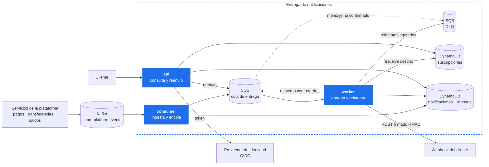
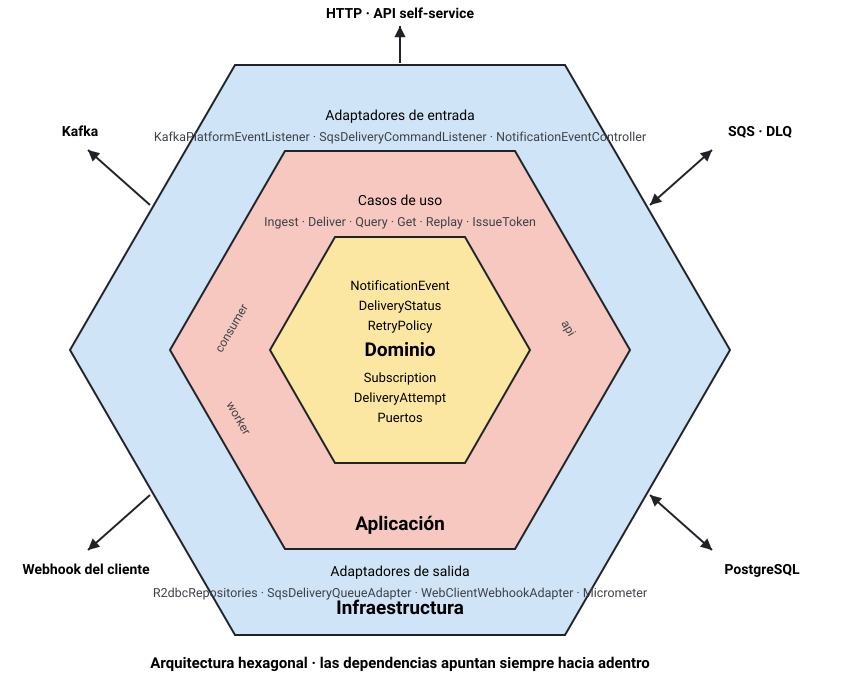
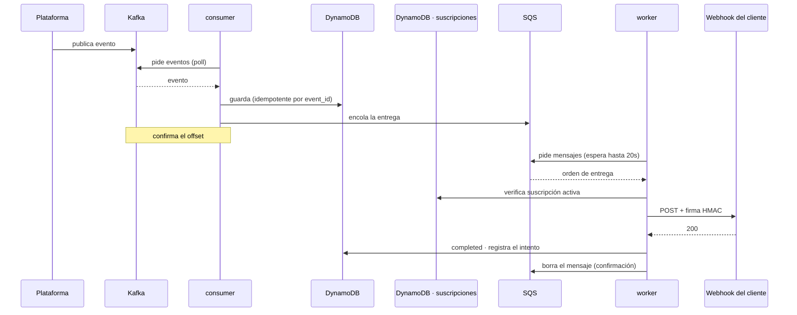
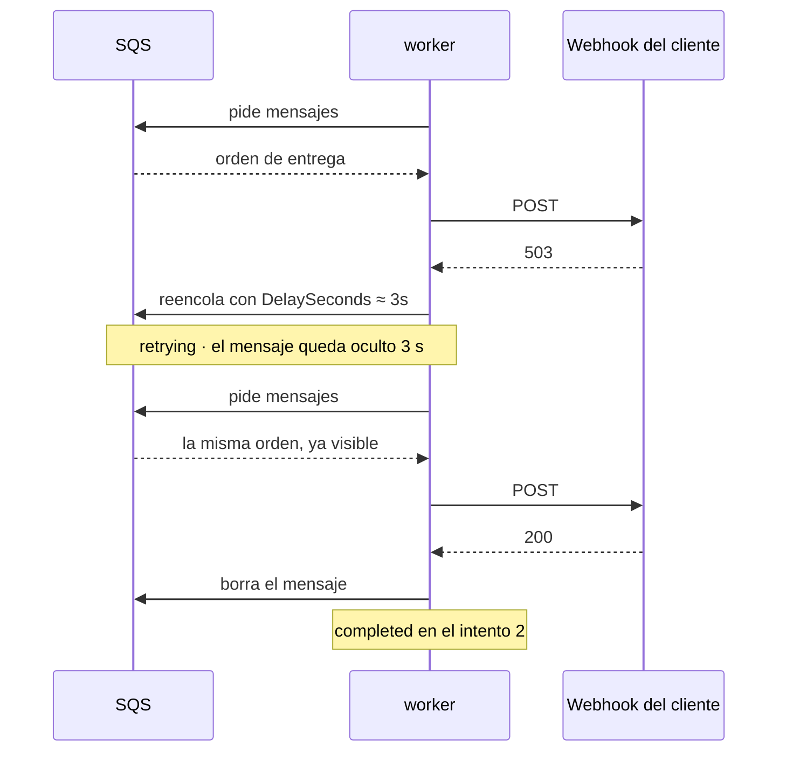
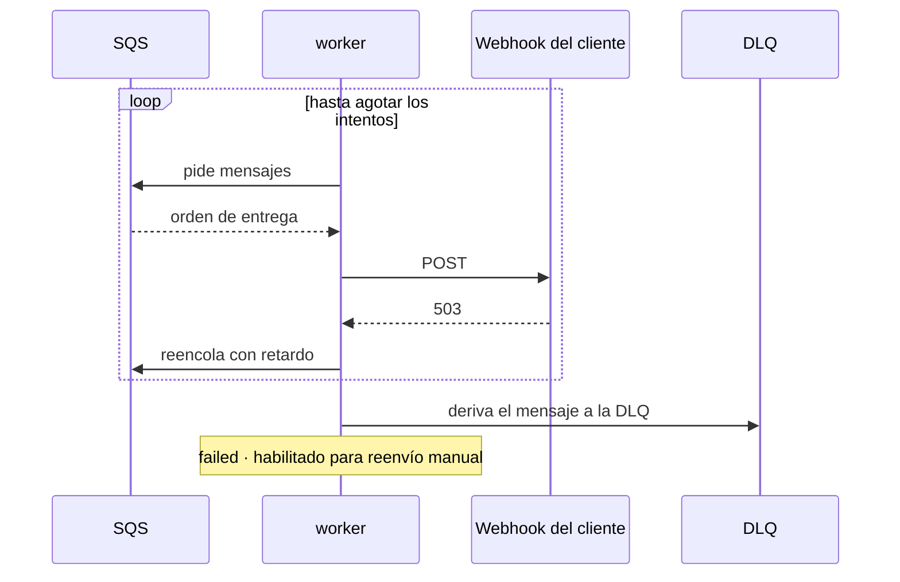
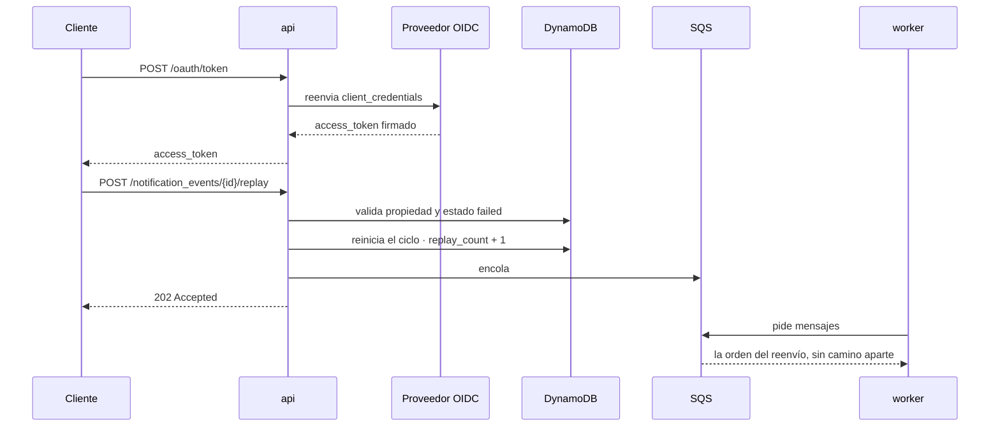
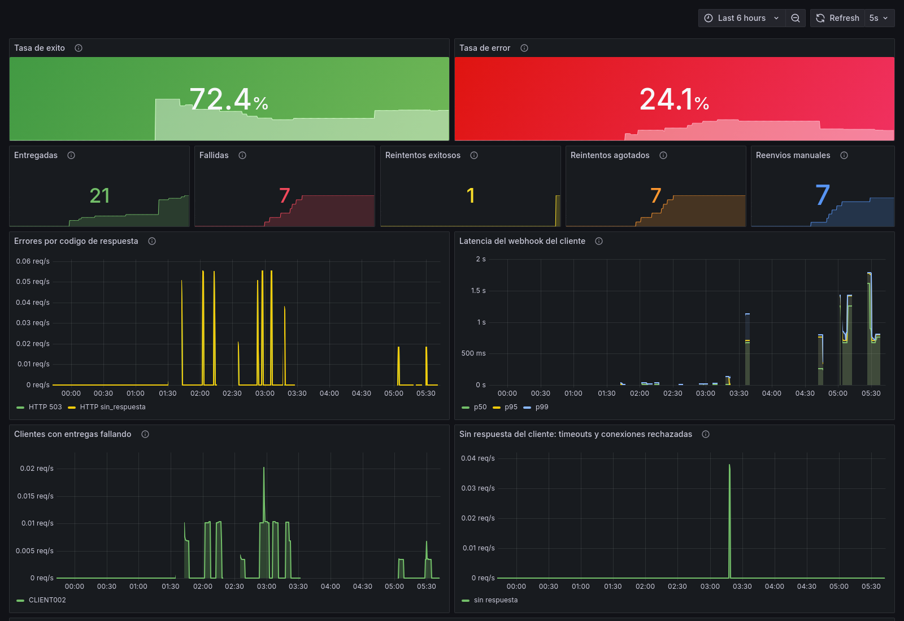

# cobre-notification-delivery

Entrega notificaciones de eventos a los webhooks de los clientes, con reintentos, firma
HMAC y bitácora de cada intento. Expone además una API self-service de consulta y reenvío.

Prueba técnica para Cobre.

```
GET  /notification_events              listado con filtros y paginación
GET  /notification_events/{id}         detalle con la bitácora de cada intento
POST /notification_events/{id}/replay  reenvío de una entrega fallida

POST /subscriptions                    registra el webhook y devuelve su secreto de firma
GET  /subscriptions                    las suscripciones del cliente
```

---

## 1. Arquitectura



Dentro del recuadro, lo que se despliega y opera aquí: los tres ejecutables, la cola de
trabajo y los almacenes. Fuera, lo que pertenece a otros: el bus de la plataforma, el
proveedor de identidad y el sistema del cliente.

Tres ejecutables sobre una misma librería. El bus y la cola de trabajo cumplen papeles
distintos: Kafka reparte lo que la plataforma publica, y SQS es donde espera cada entrega
pendiente con su reintento programado.

La línea punteada es el redrive automático de SQS; el resto son llamadas del componente.

### Tres componentes desplegables

| Componente | Responsabilidad | Señal de escalado |
|---|---|---|
| **consumer** | Ingesta desde el bus y encola la entrega | Retraso del consumidor |
| **worker** | Entrega al webhook y aplica los reintentos | Profundidad de la cola |
| **api** | Consulta y reenvío manual | Peticiones por segundo |

Cada uno se despliega por separado y carga solo las dependencias que usa:

| Componente | Dependencia propia | Lo que no incluye |
|---|---|---|
| `consumer` | `reactor-kafka`, `kafka-clients` | Spring Security |
| `worker` | cliente HTTP reactivo, firma HMAC | Kafka, Spring Security |
| `api` | Spring Security, resource server JWT | Kafka |

### Kafka y SQS

Kafka es el bus de la plataforma: no elimina el mensaje al leerlo, de modo que varios servicios
consumen el mismo evento.

SQS es la cola de trabajo de las entregas. Aporta el retardo por mensaje que implementa el
backoff (`DelaySeconds`) y la cola de mensajes no entregados (DLQ).

En local son Redpanda y ElasticMQ, que hablan los mismos protocolos.

El razonamiento detrás de esta separación está en el [documento de diseño](docs/01-diseno-del-sistema.md#8-propiedades-exigidas-a-la-infraestructura).

---

## 2. Arquitectura hexagonal



| Capa | Qué contiene |
|---|---|
| **Dominio** | El modelo y las reglas: estados, transiciones, política de reintentos. Y los puertos |
| **Aplicación** | Los casos de uso. Orquestan el dominio y los puertos |
| **Infraestructura** | Los adaptadores: Kafka, SQS, REST, DynamoDB, OIDC, WebClient, Micrometer |

Las dependencias apuntan siempre hacia adentro. `DominioSinFrameworkTest` falla el build si el
dominio importa Spring, Kafka o el SDK de AWS.

---

## 3. Escenarios

### 3.1 Entrega exitosa



Ni Kafka ni SQS empujan: el consumidor y el worker piden con *long polling*.

Entrega **al menos una vez**: el offset de Kafka se confirma tras persistir y el mensaje de SQS
se borra tras entregar. La ingesta es idempotente por `event_id` y cada entrega lleva la
cabecera `X-Cobre-Event-Id` para que el receptor descarte repeticiones.

### 3.2 Entrega recuperada tras reintentos



Escalones de espera: **5s · 30s · 2m · 10m · 15m**, cada uno con un componente aleatorio
(*jitter*) de hasta el 20 %.

### 3.3 Reintentos agotados



El evento queda en `failed` con su bitácora completa y el mensaje se deriva a la DLQ.

Las respuestas 4xx no llegan aquí: se clasifican como fallo permanente y no se reintentan.

### 3.4 Reenvío manual



Responde **202**: la solicitud queda encolada. La bitácora es de solo adición, así que el
reenvío conserva los intentos del ciclo anterior.

---

## 4. Evidencia

### Traza de una notificación en los logs

Evento que falla en el primer intento y se entrega en el segundo:

```
17:24:34.167            DEBUG        Evento EVT-RECUPERA-README del cliente CLIENT001 aceptado y encolado
17:24:34.181  delivery  INFO   503   Entrega saliente -> 503 en 8ms
17:24:34.193            WARN         Entrega de EVT-RECUPERA-README fallo (intento 1, status 503): reintento en PT3.234S
17:24:37.226  delivery  INFO   200   Entrega saliente -> 200 en 3ms
17:24:37.240            INFO         Notificacion EVT-RECUPERA-README entregada al cliente CLIENT001 en el intento 2
```

`PT3.234S` son 3,234 segundos en formato ISO-8601. Cada línea lleva `event_id`, `client_id` y
`request_id` como campos indexados. El `content` de la notificación no se registra.

### Consulta de los logs en Kibana

Los logs se indexan en Elasticsearch y se consultan desde Kibana con cinco vistas
versionadas en el repositorio: todo el tráfico, entregas, llamadas a la API, solo errores y
traza de un evento. Se cargan con `./scripts/kibana-import.sh`.

### Métricas en Grafana



Paneles: entregadas, fallidas, reintentos exitosos, reintentos agotados, reenvíos manuales,
errores por código, latencia del webhook, clientes con entregas fallando y timeouts.

### Listado paginado por cursor

```json
{
  "data": [ { "event_id": "EVT008", "delivery_status": "completed" } ],
  "size": 20,
  "next_cursor": "c2sJTUVUQQpwawlFVkVOVCNFVlQwMDg…",
  "has_next": true
}
```

La primera página se pide sin `cursor`; para la siguiente se devuelve el `next_cursor` tal
como llegó. No hay total de elementos: contarlos exige recorrer todas las notificaciones que
cumplen el filtro, y ese recorrido costaría más que la propia página. El cursor es opaco y va
atado al cliente que lo obtuvo, así que el de otro tenant se rechaza con 400.

### Bitácora devuelta por la API

```json
{
  "event_id": "EVT-RECUPERA-README",
  "delivery_status": "completed",
  "attempts": 2,
  "delivery_attempts": [
    { "attempt_number": 2, "outcome": "delivered",         "http_status": 200, "duration_ms": 3 },
    { "attempt_number": 1, "outcome": "retryable_failure", "http_status": 503, "duration_ms": 9 }
  ]
}
```

### Pruebas

190 pruebas, sin fallos. Cobertura agregada de los cuatro módulos: 94,5 % de instrucciones
y 94,6 % de líneas. El build falla si desciende del 90 %.

---

## 5. Ejecución

Requisitos: Docker. Nada más — ni Java ni Gradle instalados.

Todos los comandos se ejecutan desde la raíz del repositorio, la carpeta que contiene
`docker-compose.yml`:

```bash
git clone https://github.com/ssalaza7/cobre-notification-delivery.git
cd cobre-notification-delivery
```

```bash
# 1. Secreto de firma de tokens. Ningún módulo arranca sin él.
cp .env.example .env
set -a; source .env; set +a

# 2. Todo el entorno: infraestructura, observabilidad y los tres servicios
docker compose --profile apps --profile observability up -d --build
```

La primera vez tarda unos minutos construyendo las tres imágenes. Después, segundos.

```bash
docker compose --profile apps --profile observability ps      # qué está arriba
```

### Probar

Importar [la colección de Postman](postman/) y ejecutarla de arriba abajo. Crea su propio
destino en webhook.site, registra el webhook, publica eventos y consulta el resultado. No hay
que preparar nada.

```bash
npx newman run postman/cobre-notification-delivery.postman_collection.json
```

### Ver qué pasa

| Dónde | URL | Qué se ve |
|---|---|---|
| **Grafana** | http://localhost:3000 | Entregas, reintentos, latencia, clientes fallando |
| **Kibana** | http://localhost:5601 | La traza de cada notificación. Vistas: `./scripts/kibana-import.sh` |
| **Kafka** | http://localhost:8085 | El topic, sus mensajes y el grupo de consumo |
| **SQS** | http://localhost:9325 | La cola de entrega y la DLQ, con su profundidad |
| **Identidad** | http://localhost:8087 | Clientes y alcances en Keycloak (`admin` / `admin`) |

### Empezar de cero

Antes de un ensayo o de una demostración, para que los tableros no arrastren datos de pruebas
anteriores. Logs y métricas viven en sistemas distintos, así que hay que limpiar los dos:

```bash
# 1. Detener lo que escribe y lo que lee
docker compose --profile apps stop consumer worker api
docker compose --profile observability stop filebeat

# 2. Borrar: indice de Elasticsearch, archivos locales, historial de Prometheus
curl -X DELETE "http://localhost:9200/_data_stream/cobre-notifications*"
rm -f logs/*
docker compose --profile observability rm -sf filebeat prometheus

# 3. Levantar de nuevo
docker compose --profile apps --profile observability up -d
```

El orden importa: borrar los archivos con los servicios corriendo no los cierra, y siguen
escribiendo a un archivo que ya no existe hasta que se reinician.

### Apagar

```bash
docker compose --profile apps --profile observability down
```

Añadiendo `-v` borra también los datos de DynamoDB.

### Puertos

API 8080 · worker 8081 · consumer 8083 · Grafana 3000 · Kibana 5601 · Kafka 8085 · SQS 9325 · Keycloak 8087 · DynamoDB 8000

El perfil `local` acorta los escalones de reintento para poder verlos completos y admite
destinos HTTP. En cualquier otro perfil se exige HTTPS y se bloquean las direcciones internas.

---

## 6. Documentación

| Documento | Contenido |
|---|---|
| [Diseño del sistema](docs/01-diseno-del-sistema.md) | Task 1 — escalabilidad, resiliencia, despliegue |
| [Seguridad OWASP](docs/02-seguridad-owasp.md) | Task 3 — vulnerabilidades identificadas y mitigaciones |
| [Guía de uso](docs/03-guia-de-uso.md) | Registro de webhooks, tokens, Postman, consolas, receptor de pruebas |

---

## 7. Trade-offs

| Decisión | Alternativa | Por qué esta | Cuándo se revisaría |
|---|---|---|---|
| **Kafka como bus, SQS como cola de trabajo** | Solo Kafka | Kafka no tiene retardo por mensaje, y su orden por partición deja que un webhook lento bloquee a los demás clientes | Si el retardo y el reparto sin orden llegaran al bus |
| **Los tres comparten base de datos** | Cada uno dueño de sus datos, con CQRS | Comparten la máquina de estados; duplicarla daría divergencia, no independencia | Cuando la entrega y la consulta tengan equipos y SLA distintos |
| **DynamoDB para eventos e intentos** | PostgreSQL para todo | El flujo de entrega solo accede por `event_id` y lista por cliente y fecha; ambas son consultas por clave, y la bitácora crece sin techo | Si hiciera falta agregar o cruzar eventos, que en clave-valor obliga a recorrerlos |
| **Suscripciones en DynamoDB, en tabla aparte** | Junto a los eventos, o en relacional | Nunca se leen con un evento en la misma consulta, así que compartir tabla no ahorra viajes; y todo acceso parte del `client_id`, que es la clave de partición | Si hiciera falta consultar suscripciones por algo que no sea el cliente |
| **La identidad la lleva un proveedor OIDC** | Emitir y firmar los tokens aquí | Un servicio de notificaciones no debería custodiar credenciales; delegando, no guarda ningún secreto y valida contra claves públicas rotables | No aplica: administrar identidad es otro contexto |
| **Paginación por cursor** | Número de página con total | En clave-valor saltar a la página N cuesta leer las N anteriores, y el total exige recorrerlo todo | No aplica: el coste constante es la razón de ser del cursor |
| **Los tres son reactivos** | La api bloqueante con hilos virtuales | Evita duplicar la capa de persistencia; el worker sí lo necesita, porque espera a terceros lentos | Si la api creciera hasta justificar su propio modelo de datos |
| **Entrega al menos una vez** | Confirmar antes de procesar | Un duplicado que el cliente descarta cuesta menos que un pago no notificado | No aplica: el estándar en notificaciones de pago |
| **Anti-SSRF por lista negra** | Allowlist de dominios verificados por cliente | Suficiente para la prueba; la allowlist exige verificación de dominio y fijar la IP resuelta | Antes de exponerlo a clientes reales |
| **Límite de tasa en la aplicación** | WAF en el borde | Sin infraestructura adicional | En AWS, donde el control pertenece al WAF |
| **Un repositorio con los cinco módulos** | Repositorios separados con las librerías publicadas | Evita el ciclo de publicación en cada cambio del dominio | Si los componentes tuvieran equipos distintos |

---

## 8. Limitaciones conocidas

1. **No hay circuit breaker por cliente.**
2. **El límite de tasa es por instancia**, no global.
3. **No hay pruebas de integración con infraestructura real.** Pendiente: Testcontainers.
4. **El secreto de firma del webhook se almacena en texto plano.** Pendiente: cifrarlo con KMS.
5. **La DLQ no tiene reproceso automático** ni alarma por profundidad.

---

```bash
docker compose --profile observability down
```
