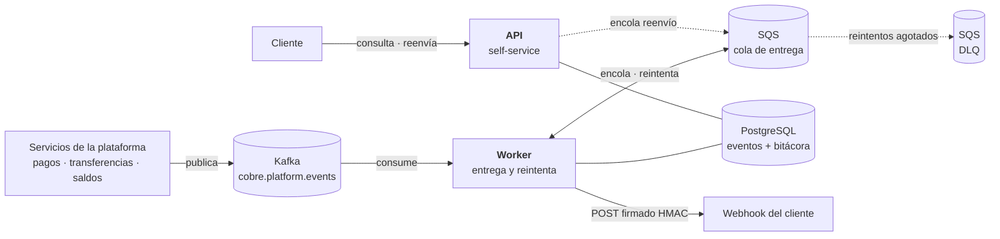
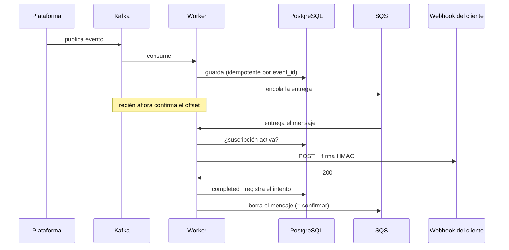
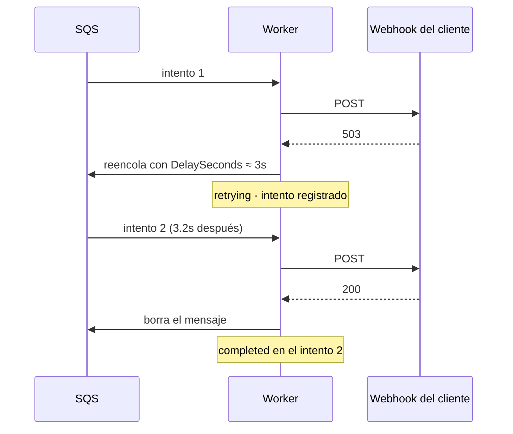
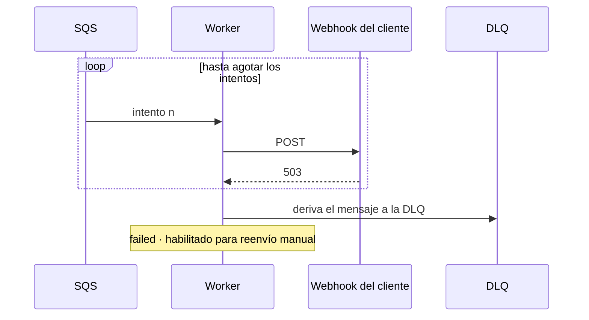
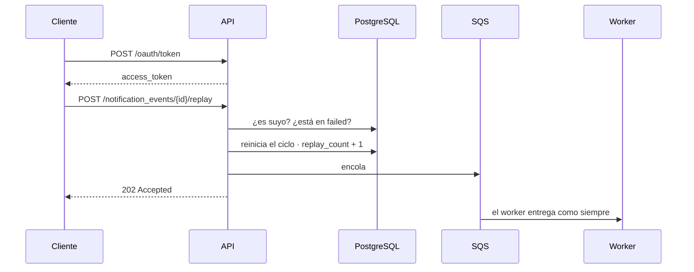

# notification-delivery-service

Entrega notificaciones de eventos a los webhooks de los clientes —con reintentos, firma y
bitácora— y expone una API para que el cliente consulte y reenvíe las suyas.

Prueba técnica para **Cobre**.

```
GET  /notification_events              listado con filtros y paginación
GET  /notification_events/{id}         detalle con la bitácora de cada intento
POST /notification_events/{id}/replay  reenvío de una entrega fallida
```

---

## 1. Arquitectura



**Worker y API son despliegues independientes.** El worker aguanta toda la carga que genere
la plataforma; la API, la que generen las personas. Escalar uno no debería obligar a pagar
réplicas del otro. La misma imagen arranca como uno u otro según `COBRE_ROLE`.

**Kafka es el bus** —la plataforma publica ahí y cualquier servicio lee, sin borrar al leer—
y **SQS es la cola de trabajo**. Se separan porque el paralelismo de Kafka lo topan las
particiones, mientras que en SQS cada consumidor toma el siguiente mensaje libre. Además SQS
trae de fábrica lo que la entrega necesita: retardo por mensaje (el backoff) y DLQ.

En local son **Redpanda** y **ElasticMQ**: mismos protocolos, así que el código es idéntico
al que correría contra Confluent Cloud y AWS.

---

## 2. Hexagonal

```
domain/          modelo puro · CERO imports de framework
application/     port/in · port/out · casos de uso
infrastructure/  adaptadores: REST · Kafka · SQS · R2DBC · WebClient · Micrometer
```

Las dependencias apuntan **siempre hacia adentro**. `domain` y `application` no importan una
sola clase de Spring; el cableado vive en `infrastructure/config`.

**Cómo se comprueba:** las pruebas del dominio y de los casos de uso corren sin contexto de
Spring, sin base de datos y sin broker. **Qué compró:** se cambió RabbitMQ por Kafka + SQS
sin tocar una línea del dominio ni de los casos de uso.

---

## 3. Los cuatro escenarios

### 3.1 Entrega exitosa



El offset de Kafka se confirma **después** de persistir, y el mensaje de SQS se borra
**después** de entregar. Si el proceso muere a mitad, el evento se reentrega: preferimos que
llegue dos veces —la ingesta es idempotente y cada entrega lleva `X-Cobre-Event-Id` para que
el cliente descarte repetidos— a que un pago no se notifique nunca.

### 3.2 Con reintentos, recuperada



Las esperas crecen —**5s · 30s · 2m · 10m · 15m**, tope de `DelaySeconds` en SQS— y llevan
**jitter**: un porcentaje aleatorio que las desordena. Sin él, los 200 pendientes de un
cliente que se cayó reintentarían en el mismo segundo y volverían a tumbarlo.

### 3.3 Reintentos agotados



No se pierde nada: el evento queda en `failed` con toda su bitácora y el mensaje va a la
**DLQ** (*dead letter queue*), que es una bandeja de revisión, no un basurero.

Un 4xx no llega aquí: es fallo **permanente** y no se reintenta, porque insistir daría el
mismo 4xx.

### 3.4 Reenvío manual



**202 y no 200**: quedó encolado, no entregado. La bitácora es append-only — el reenvío no
borra los intentos anteriores.

---

## 4. Evidencia

### Una notificación completa, en los logs

Evento que falló y se recuperó. **Seis líneas, no sesenta:**

```
17:24:34.167            DEBUG        Evento EVT-RECUPERA-README del cliente CLIENT001 aceptado y encolado
17:24:34.181  delivery  INFO   503   Entrega saliente -> 503 en 8ms
17:24:34.193            WARN         Entrega de EVT-RECUPERA-README fallo (intento 1, status 503): reintento en PT3.234S
17:24:37.226  delivery  INFO   200   Entrega saliente -> 200 en 3ms
17:24:37.240            INFO         Notificacion EVT-RECUPERA-README entregada al cliente CLIENT001 en el intento 2
```

`PT3.234S` es cómo Java escribe 3,234 segundos; ese decimal es el jitter. Cada línea lleva
`event_id`, `client_id` y `request_id` como campos indexados. **El `content` nunca se
registra**: es dato financiero del cliente.

### Los logs en Kibana


### Las métricas en Grafana


Lo que importa mirar: **reintentos exitosos** (los que se recuperaron solos — el número que
justifica toda la estrategia), **reintentos agotados** (los que requieren intervención) y
**clientes con entregas fallando** (qué cliente se cayó, para avisarle).

### La bitácora que devuelve la API

```json
{
  "event_id": "EVT-RECUPERA-README",
  "delivery_status": "completed",
  "attempts": 2,
  "delivery_attempts": [
    { "attempt_number": 2, "outcome": "delivered",         "http_status": 200, "duration_ms": 3 },
    { "attempt_number": 1, "outcome": "retryable_failure", "http_status": 503, "duration_ms": 9 }
  ]
}
```

### Pruebas

**196 pruebas, 0 fallos.** Cobertura **94.5% instrucciones / 94.6% líneas**; el build falla
si baja del 90%.

---

## 5. Cómo correr

```bash
# 1. Secreto. La aplicación NO arranca sin él, a propósito.
cp .env.example .env
openssl rand -base64 48          # pega el resultado en JWT_SECRET
set -a; source .env; set +a

# 2. Postgres, Kafka (Redpanda) y SQS (ElasticMQ)
docker compose up -d

# 3. Un receptor que hace de cliente y verifica la firma
python3 scripts/webhook-receiver.py

# 4. La aplicación
SPRING_PROFILES_ACTIVE=local ./gradlew bootRun

# 5. Disparar una notificación
./scripts/publish-event.sh EVT-DEMO-1 CLIENT001 credit_transfer "Transferencia por 1.500.000"
```

Requisitos: Docker y Java 21. Gradle no hace falta instalarlo.

El perfil `local` acorta los reintentos y permite HTTP hacia `localhost`. **En cualquier
otro perfil se exige HTTPS y se bloquean destinos internos.**

Las consolas (Grafana, Kibana, Prometheus) se levantan con
`docker compose --profile observability up -d`.

---

## 6. Documentación

| Documento | Contenido |
|---|---|
| [Diseño del sistema](docs/01-diseno-del-sistema.md) | **Task 1** — escalabilidad, resiliencia, despliegue |
| [Seguridad OWASP](docs/02-seguridad-owasp.md) | **Task 3** — 5 vulnerabilidades con su mitigación |
| [Guía de uso](docs/03-guia-de-uso.md) | Registrar webhooks · tokens · Postman · consolas · el receptor de pruebas |

---

## 7. Limitaciones conocidas

1. **Sin circuit breaker por cliente.** Un webhook caído horas sigue gastando intentos.
2. **El rate limit es por instancia**, no global. Contiene el abuso accidental, no el
   deliberado. En AWS este control pertenece al WAF.
3. **Sin pruebas de integración con infraestructura real.** El paso pendiente es
   Testcontainers.
4. **El secreto de firma del webhook está en texto plano en la base.** No puede hashearse
   porque hay que usarlo para firmar; la mitigación es cifrarlo con KMS.
5. **La DLQ no tiene reproceso automático** ni alarma por profundidad.

---

```bash
docker compose --profile observability down
```
