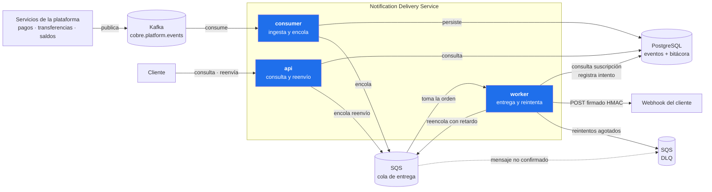
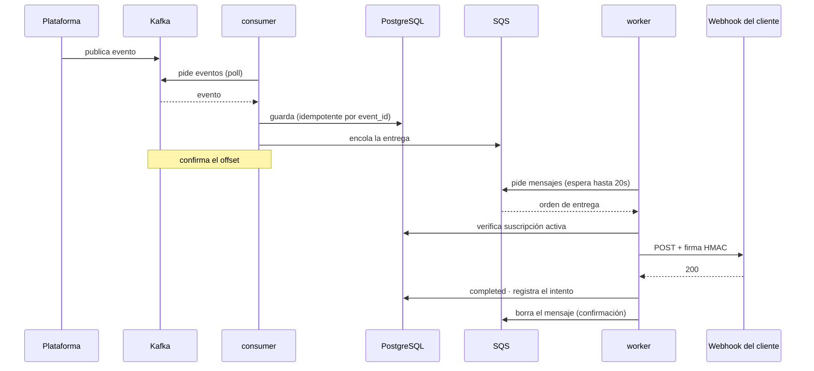
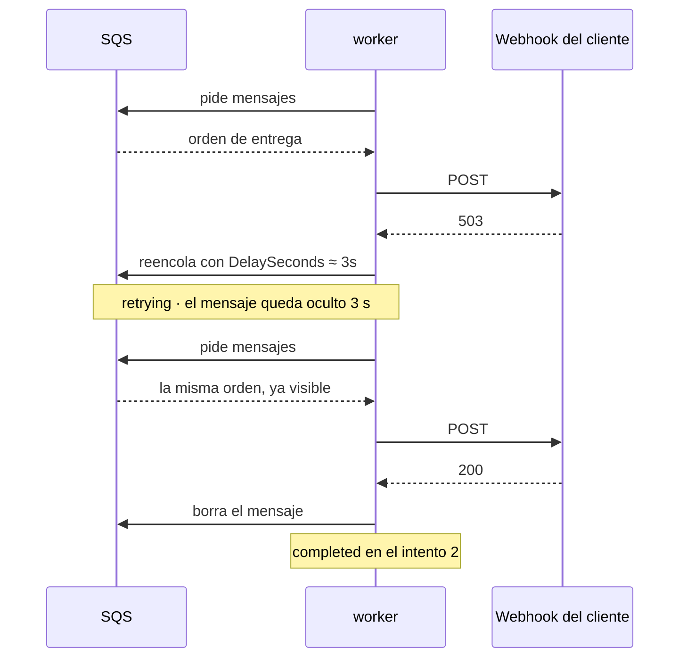
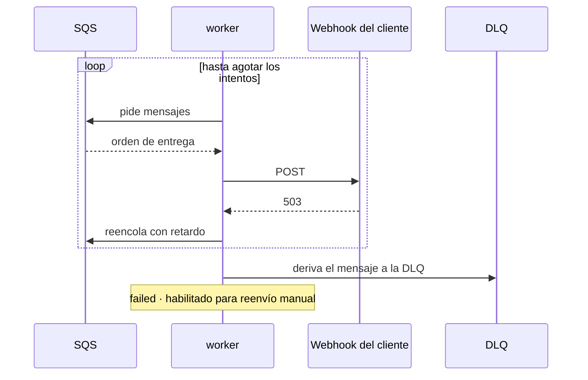
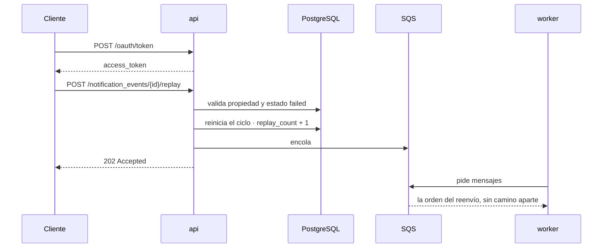

# notification-delivery-service

Servicio de entrega de notificaciones de eventos a webhooks de clientes, con reintentos,
firma HMAC y bitácora de intentos. Expone una API self-service de consulta y reenvío.

Prueba técnica para Cobre.

```
GET  /notification_events              listado con filtros y paginación
GET  /notification_events/{id}         detalle con la bitácora de cada intento
POST /notification_events/{id}/replay  reenvío de una entrega fallida
```

---

## 1. Arquitectura



La flecha indica la dirección del dato. La línea punteada marca el único flujo que ningún
componente invoca: cuando un mensaje no se confirma tras varias entregas —por ejemplo, uno
corrupto que nunca llega a procesarse— SQS lo mueve a la DLQ por su *redrive policy*.

Los reintentos agotados son distintos: ahí el worker envía el mensaje a la DLQ de forma
explícita, con el motivo del descarte.

### Tres componentes desplegables

| Componente | Responsabilidad | Señal de escalado |
|---|---|---|
| **consumer** | Ingesta desde el bus y encola la entrega | Retraso del consumidor |
| **worker** | Entrega al webhook y aplica los reintentos | Profundidad de la cola |
| **api** | Consulta y reenvío manual | Peticiones por segundo |

Se despliegan por separado porque sus cargas son de naturaleza distinta: el worker sigue el
ritmo de la plataforma y la API el de las personas. Escalar una no debe obligar a provisionar
réplicas de la otra. Además, la saturación de cada una tiene consecuencias diferentes —
consultas degradadas frente a notificaciones sin entregar.

Cada componente es un artefacto propio y carga solo las dependencias que usa. Verificable
sobre los jars construidos:

| Componente | Dependencia propia | Lo que no incluye |
|---|---|---|
| `consumer` | `reactor-kafka`, `kafka-clients` | Spring Security |
| `worker` | cliente HTTP reactivo, firma HMAC | Kafka, Spring Security |
| `api` | Spring Security, resource server JWT | Kafka |

Qué adaptadores se activan lo determina el classpath de cada artefacto, no una condición
evaluada al arrancar.

### Kafka como bus, SQS como cola de trabajo

Kafka transporta los eventos que publica la plataforma. No elimina el mensaje al leerlo, por
lo que varios servicios pueden consumir el mismo evento de forma independiente.

SQS contiene el trabajo pendiente de entrega. Se emplea para esta etapa por dos razones: el
paralelismo en Kafka está limitado por el número de particiones, mientras que en SQS cada
consumidor toma el siguiente mensaje disponible; y SQS ofrece de forma nativa el retardo por
mensaje que implementa el backoff (`DelaySeconds`) y la cola de mensajes no entregados (DLQ).

En entorno local se usan Redpanda y ElasticMQ, que implementan los mismos protocolos. El
código es idéntico al que se ejecutaría contra Confluent Cloud y AWS; solo cambian las
direcciones de conexión.

---

## 2. Arquitectura hexagonal

Cada componente tiene su propia capa de aplicación y sus adaptadores. Lo único compartido es
el interior del hexágono.

```
cobre-notificacion-domain/            modelo · reglas · puertos
                                      sin framework, sin dependencias

cobre-notificacion-kit/               implementa los puertos compartidos:
                                      R2DBC · SQS · Micrometer · logs

cobre-notificacion-consumer-service/  application/     IngestNotificationEventService
                                      infrastructure/  adaptador Kafka

cobre-notificacion-worker-service/    application/     DeliverNotificationEventService
                                      infrastructure/  cola SQS · WebClient + HMAC

cobre-notificacion-api-service/       application/     Query · Get · Replay · Token
                                      infrastructure/  REST · seguridad · tokens
```

El sufijo `-service` marca lo que se despliega. Los dos módulos sin sufijo no producen
contenedor: viajan dentro de los tres ejecutables.

Los casos de uso viven donde se usan: ninguno lo comparten dos componentes. El modelo sí se
comparte, porque los tres operan sobre las mismas tablas y la misma máquina de estados;
duplicarlo no daría independencia sino divergencia.

**`domain` no tiene Spring en el classpath**, así que la violación de la regla hexagonal no
compila. Su única dependencia es Reactor, que es una librería de composición asíncrona y no un
framework de infraestructura.

Las dependencias apuntan siempre hacia el interior. Los paquetes `domain` y `application` no
importan ninguna clase de Spring; el cableado reside en la clase de configuración de cada
componente.

**Organización del código.** Los cinco módulos viven en un mismo repositorio. Es una decisión
de organización, no de arquitectura: el diseño sería idéntico con repositorios separados y las
dos librerías publicadas como artefactos versionados. El repositorio único evita ese ciclo de
publicación en cada cambio del dominio, a cambio de que un cambio en él recompile los tres
componentes.

Algo se traslada a `kit` cuando lo necesita un segundo componente, no antes: cada dependencia
añadida allí la cargan los tres artefactos aunque dos no la utilicen. El criterio para
distinguirlo de `domain` es directo: si sabe qué es una notificación, no es kit.

La consecuencia verificable es que las pruebas del dominio y de los casos de uso se ejecutan
sin contexto de Spring, sin base de datos y sin broker.

Sustituir el sistema de mensajería, la base de datos o el cliente HTTP afecta únicamente a
los adaptadores correspondientes: ni el dominio ni los casos de uso cambian.

---

## 3. Escenarios

### 3.1 Entrega exitosa



Ni Kafka ni SQS empujan mensajes: el consumidor y el worker preguntan, y la llamada se queda
esperando hasta que haya algo o venza el tiempo. Por eso las flechas de petición salen de los
componentes, no de los brokers.

El offset de Kafka se confirma después de persistir el evento, y el mensaje de SQS se elimina
después de completar la entrega. Si el proceso termina de forma abrupta en un punto
intermedio, el evento se reentrega.

La garantía es, por tanto, de entrega **al menos una vez**: una notificación puede llegar
duplicada al cliente. La alternativa —confirmar antes de procesar— produciría pérdida
silenciosa de eventos, que en notificaciones de pagos tiene mayor impacto que un duplicado.
El duplicado se acota por dos vías: la ingesta es idempotente por `event_id`, y cada entrega
incluye la cabecera `X-Cobre-Event-Id` para que el receptor descarte repeticiones.

### 3.2 Entrega recuperada tras reintentos



Los escalones de espera son 5s, 30s, 2m, 10m y 15m. El último coincide con el máximo que
admite `DelaySeconds` en SQS.

Cada espera incorpora un componente aleatorio (*jitter*) de hasta el 20 %. Sin él, todas las
notificaciones acumuladas durante la caída de un destino se reintentarían en el mismo
instante, generando un pico de carga sobre un sistema que acaba de restablecerse.

### 3.3 Reintentos agotados



El evento queda en estado `failed` con su bitácora completa y el mensaje se deriva a la DLQ
(*dead letter queue*) para inspección. Ninguna información se descarta.

Las respuestas 4xx no llegan a este escenario: se clasifican como fallo permanente y no se
reintentan, dado que la repetición produciría el mismo resultado.

### 3.4 Reenvío manual



La respuesta es 202 y no 200: la solicitud queda encolada, no entregada. La bitácora es de
solo adición, por lo que el reenvío conserva los intentos del ciclo anterior.

---

## 4. Evidencia

### Traza de una notificación en los logs

Evento que falla en el primer intento y se entrega en el segundo:

```
17:24:34.167            DEBUG        Evento EVT-RECUPERA-README del cliente CLIENT001 aceptado y encolado
17:24:34.181  delivery  INFO   503   Entrega saliente -> 503 en 8ms
17:24:34.193            WARN         Entrega de EVT-RECUPERA-README fallo (intento 1, status 503): reintento en PT3.234S
17:24:37.226  delivery  INFO   200   Entrega saliente -> 200 en 3ms
17:24:37.240            INFO         Notificacion EVT-RECUPERA-README entregada al cliente CLIENT001 en el intento 2
```

`PT3.234S` es la representación ISO-8601 de 3,234 segundos; el decimal corresponde al jitter.

Cada línea incluye `event_id`, `client_id` y `request_id` como campos indexados, lo que
permite reconstruir el ciclo completo con una sola consulta. El campo `content` de la
notificación no se registra, por tratarse de información financiera del cliente.

### Consulta de los logs en Kibana

Los logs se indexan en Elasticsearch y se consultan desde Kibana con cinco vistas
versionadas en el repositorio: todo el tráfico, entregas, llamadas a la API, solo errores y
traza de un evento. Se cargan con `./scripts/kibana-import.sh`.

### Métricas en Grafana


Los indicadores principales son *reintentos exitosos* (entregas recuperadas por el backoff,
que cuantifican el valor de la estrategia de reintentos), *reintentos agotados* (casos que
requieren intervención) y *clientes con entregas fallando* (identificación del cliente
afectado para notificar a su equipo).

### Bitácora devuelta por la API

```json
{
  "event_id": "EVT-RECUPERA-README",
  "delivery_status": "completed",
  "attempts": 2,
  "delivery_attempts": [
    { "attempt_number": 2, "outcome": "delivered",         "http_status": 200, "duration_ms": 3 },
    { "attempt_number": 1, "outcome": "retryable_failure", "http_status": 503, "duration_ms": 9 }
  ]
}
```

### Pruebas

192 pruebas, sin fallos. Cobertura agregada de los cinco módulos: 94,3 % de instrucciones
y 94,6 % de líneas. El build falla si desciende del 90 %.

---

## 5. Ejecución

Requisitos: Docker y Java 21. No es necesario instalar Gradle.

Puertos: la API en 8080, el worker en 8081 y el consumidor en 8083.

```bash
# 0. Construir los tres jars
./gradlew bootJar

# 1. Secreto de firma de tokens. Ningún módulo arranca sin él.
cp .env.example .env
openssl rand -base64 48          # asignar el resultado a JWT_SECRET
set -a; source .env; set +a

# 2. PostgreSQL, Kafka (Redpanda) y SQS (ElasticMQ)
docker compose up -d

# 3. Receptor de webhooks de prueba: simula el sistema del cliente y verifica la firma
python3 scripts/webhook-receiver.py

# 4. Los tres ejecutables, en terminales separadas
SPRING_PROFILES_ACTIVE=local java -jar cobre-notificacion-api-service/build/libs/cobre-notificacion-api-service-0.0.1-SNAPSHOT.jar
SPRING_PROFILES_ACTIVE=local java -jar cobre-notificacion-worker-service/build/libs/cobre-notificacion-worker-service-0.0.1-SNAPSHOT.jar
SPRING_PROFILES_ACTIVE=local java -jar cobre-notificacion-consumer-service/build/libs/cobre-notificacion-consumer-service-0.0.1-SNAPSHOT.jar

# 5. Publicación de un evento
./scripts/publish-event.sh EVT-DEMO-1 CLIENT001 credit_transfer "Transferencia por 1.500.000"
```

El perfil `local` reduce los escalones de reintento y admite destinos HTTP en `localhost`.
En cualquier otro perfil se exige HTTPS y se bloquean las direcciones internas.

Las consolas de observabilidad se levantan con
`docker compose --profile observability up -d`.

---

## 6. Documentación

| Documento | Contenido |
|---|---|
| [Diseño del sistema](docs/01-diseno-del-sistema.md) | Task 1 — escalabilidad, resiliencia, despliegue |
| [Seguridad OWASP](docs/02-seguridad-owasp.md) | Task 3 — vulnerabilidades identificadas y mitigaciones |
| [Guía de uso](docs/03-guia-de-uso.md) | Registro de webhooks, tokens, Postman, consolas, receptor de pruebas |

---

## 7. Limitaciones conocidas

1. **No hay circuit breaker por cliente.** Un destino caído durante horas continúa
   consumiendo intentos en cada evento.
2. **El límite de tasa es por instancia**, no global. Contiene el abuso accidental pero no el
   deliberado. En un despliegue en AWS este control corresponde al WAF.
3. **No hay pruebas de integración con infraestructura real.** Los adaptadores de
   persistencia y el cableado de beans quedan fuera del umbral de cobertura. El paso
   pendiente es Testcontainers.
4. **El secreto de firma del webhook se almacena en texto plano.** No admite hash porque debe
   usarse para calcular el HMAC de cada entrega. La mitigación es cifrarlo con KMS.
5. **La DLQ no dispone de reproceso automático** ni de alarma por profundidad de cola.

---

```bash
docker compose --profile observability down
```
