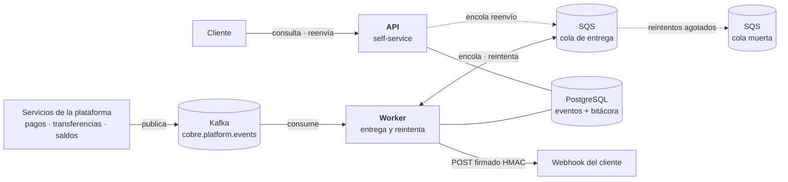
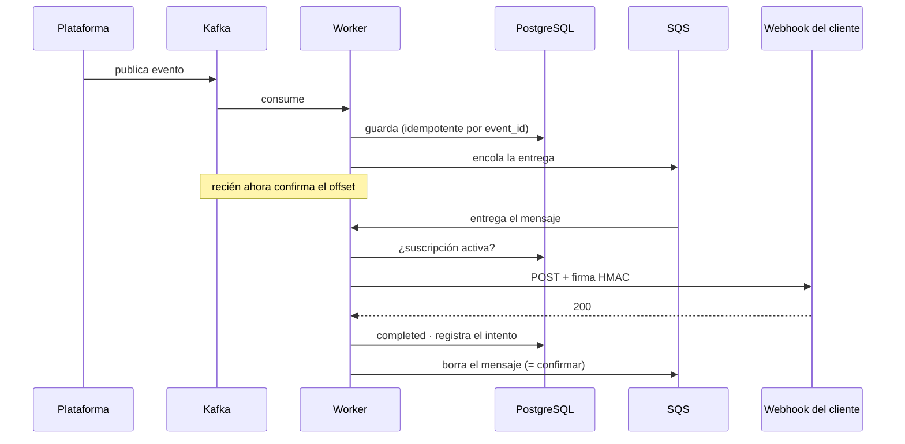
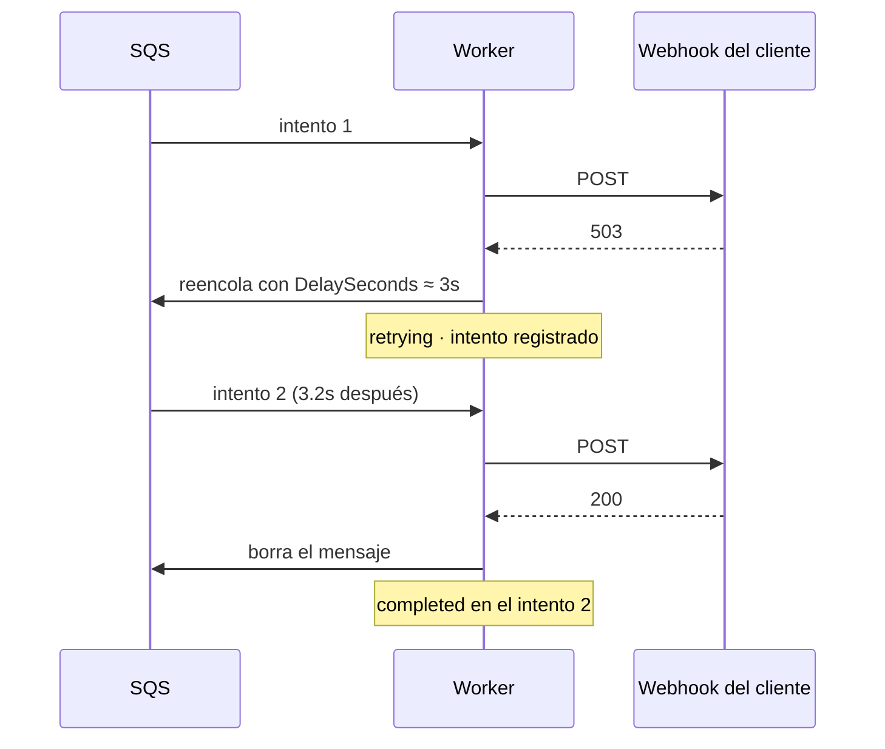
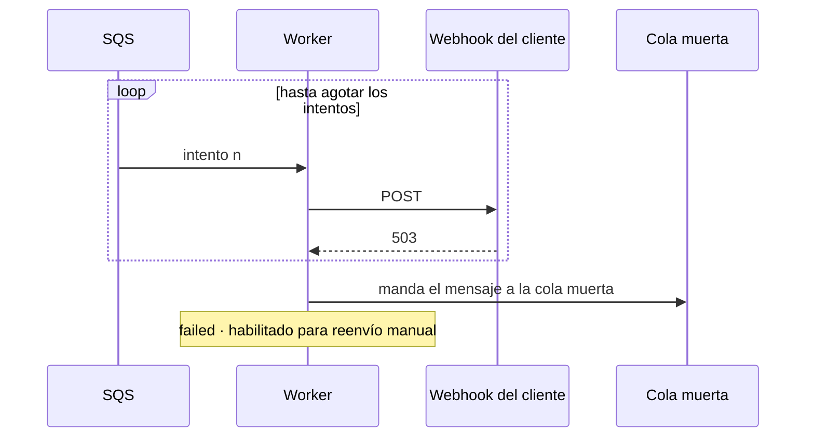
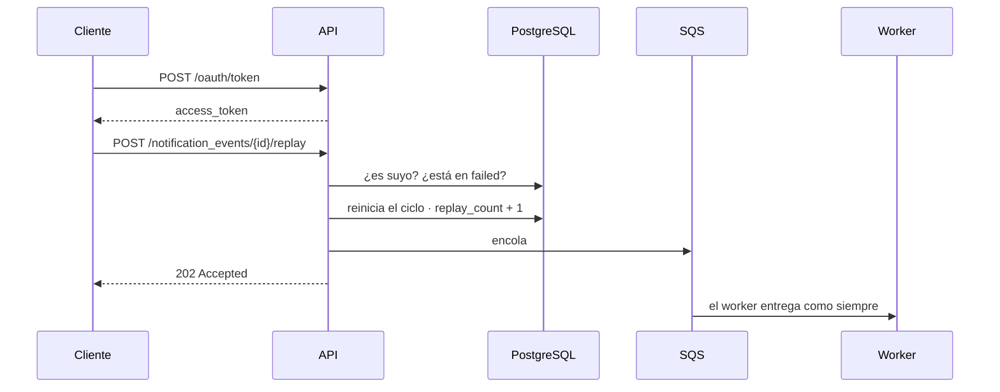

# notification-delivery-service

Entrega notificaciones de eventos a los webhooks de los clientes —con reintentos, firma y
bitácora— y expone una API para que el cliente consulte y reenvíe las suyas.

Prueba técnica para **Cobre**. Funciona de punta a punta; este README lo demuestra con
evidencia real, no con descripciones.

```
GET  /notification_events              listado con filtros y paginación
GET  /notification_events/{id}         detalle con la bitácora de cada intento
POST /notification_events/{id}/replay  reenvío de una entrega fallida
```

---

## 1. Cómo está armado



**Dos protagonistas, y hacen cosas distintas.**

| | Qué hace | Carga |
|---|---|---|
| **Worker** | Consume de Kafka, entrega al webhook, reintenta, rinde a la cola muerta | Toda la que genere la plataforma |
| **API** | Responde consultas y acepta reenvíos | La que generen las personas |

Por eso son **despliegues independientes**: escalar el worker en una tormenta de eventos
no debería obligar a pagar réplicas de una API que nadie está usando. La misma imagen
arranca como uno u otro según la variable `COBRE_ROLE`.

**Por qué dos sistemas de mensajería y no uno**

Kafka es el **bus**: la plataforma publica ahí sus eventos y cualquier servicio los lee.
No borra al leer, así que otros equipos consumen lo mismo sin estorbarse.

SQS es la **cola de trabajo**: ahí vive el pendiente de entregar. Se eligió porque el
paralelismo de Kafka lo topan las particiones —diez réplicas sobre tres particiones dejan
siete sin hacer nada—, mientras que en SQS cada consumidor toma el siguiente mensaje
libre. Además trae de fábrica lo que la entrega necesita: retardo por mensaje
(`DelaySeconds`, el backoff) y cola muerta con política de reintentos.

En local son **Redpanda** y **ElasticMQ**: hablan los mismos protocolos, así que el código
es idéntico al que correría contra Confluent Cloud y AWS. Solo cambian las direcciones.

---

## 2. Arquitectura hexagonal

```
domain/          modelo puro · CERO imports de framework
application/     port/in · port/out · casos de uso
infrastructure/  adaptadores: REST · Kafka · SQS · R2DBC · WebClient · Micrometer
```

Las dependencias apuntan **siempre hacia adentro**. `domain` y `application` no importan
una sola clase de Spring; todo el cableado vive en `infrastructure/config`.

**Cómo se comprueba sin creerme:** las pruebas del dominio y de los casos de uso corren
sin contexto de Spring, sin base de datos y sin broker. Si alguna capa interna hubiera
tocado el framework, no compilarían así.

Lo que compra en la práctica: se quitó RabbitMQ y se puso Kafka + SQS **sin tocar una
línea del dominio ni de los casos de uso**. Se reescribieron adaptadores y nada más.

---

## 3. Los cuatro escenarios

### 3.1 Entrega exitosa



El orden importa: **el offset de Kafka se confirma después de persistir**, y el mensaje de
SQS **se borra después de entregar**. Si el proceso muere en cualquier punto intermedio, el
evento se reentrega. Se prefiere entregar dos veces a perder una.

### 3.2 Entrega con reintentos, recuperada



Las esperas crecen —5s · 30s · 2m · 10m · 15m— y llevan **jitter**: un porcentaje aleatorio
que las desordena. Sin jitter, si el webhook de un cliente se cae un minuto, todas sus
notificaciones fallan a la vez y reintentarían en el mismo instante, tumbándolo otra vez
justo cuando se estaba levantando.

Ningún escalón pasa de 15 minutos porque ese es el tope de `DelaySeconds` en SQS.

### 3.3 Reintentos agotados



No se pierde nada: el evento queda en `failed` con toda su bitácora, y el mensaje queda en
la cola muerta para inspección. **La API de reenvío existe justamente para este estado.**

Una URL inválida no llega aquí: si el webhook no es HTTPS o apunta a la red interna, es un
fallo **permanente** y falla al primer intento. Insistir no lo va a arreglar.

### 3.4 Reenvío manual desde la API



**202 y no 200**: quedó encolado, no entregado. Repetir la llamada devuelve `409`, porque
ya no está en fallo definitivo.

La bitácora es **append-only**: el reenvío no borra los intentos anteriores. Después de un
reenvío exitoso el detalle muestra 4 intentos en 2 ciclos, no 1 intento.

---

## 4. Evidencia

### 4.1 Una notificación completa, en los logs

Traza real de un evento que falló y se recuperó. Son **seis líneas**, no sesenta:

```
17:24:34.167            DEBUG        Evento EVT-RECUPERA-README del cliente CLIENT001 aceptado y encolado
17:24:34.181  delivery  INFO   503   Entrega saliente -> 503 en 8ms
17:24:34.193            WARN         Entrega de EVT-RECUPERA-README fallo (intento 1, status 503): reintento en PT3.234S
17:24:37.226  delivery  INFO   200   Entrega saliente -> 200 en 3ms
17:24:37.240            INFO         Notificacion EVT-RECUPERA-README entregada al cliente CLIENT001 en el intento 2
```

Ese `PT3.234S` es el jitter en acción: no es 3s redondos.

Cada línea lleva `event_id`, `client_id` y `request_id` **como campos indexados**, así que
una sola consulta reconstruye el ciclo. Que el campo sobreviva es lo difícil: la entrega
empieza en el hilo del consumidor y termina en el de Netty segundos después, tras un
reintento. Se propaga por el contexto reactivo hasta el MDC.

**El `content` de la notificación nunca se registra**: es dato financiero del cliente.

### 4.2 Lo mismo visto en Kibana


Las vistas vienen versionadas en [`observability/kibana/vistas.ndjson`](observability/kibana/vistas.ndjson)
y se cargan con un comando, así que no hay que armarlas a mano ni se pierden al recrear el
contenedor:

```bash
./scripts/kibana-import.sh
```

Quedan cinco, en *Discover → Open*: todo el tráfico · entregas · llamadas a la API · solo
errores · traza de un evento.

**Lo que se quitó del log a propósito:** los once campos `host.*` (describían el contenedor
de Filebeat, no el servicio), los metadatos del recolector, el nombre del hilo, los logs de
arranque de Flyway y Netty, y los accesos a `/actuator` —que Prometheus consulta cada 5
segundos y serían ~17.000 líneas diarias de ruido—. De **26 campos por documento a 14**.

### 4.3 Las métricas en Grafana


| Panel | Para qué sirve |
|---|---|
| Entregadas · Fallidas | El resultado neto |
| **Reintentos exitosos** | Las que fallaron y se recuperaron solas. Es el número que justifica toda la estrategia: sin reintentos, perdidas |
| **Reintentos agotados** | Las que fallaron hasta el final. Requieren intervención |
| Reenvíos manuales | Si crece, algo estructural está roto |
| **Errores por código** | Un 5xx es transitorio; un 4xx es contrato roto |
| **Latencia del webhook** | p50 · p95 · p99. Es lo primero que se degrada, antes de los timeouts |
| A la primera vs. recuperadas | Si la franja de recuperadas crece, los destinos se están degradando aunque el resultado final siga bien |

Ninguna métrica lleva `client_id` como etiqueta: con miles de clientes eso multiplica las
series de tiempo y, en Datadog, la factura.

### 4.4 La bitácora que devuelve la API

```json
{
  "event_id": "EVT-RECUPERA-README",
  "delivery_status": "completed",
  "attempts": 2,
  "replay_count": 0,
  "delivery_attempts": [
    { "attempt_number": 2, "outcome": "delivered",         "http_status": 200, "duration_ms": 3 },
    { "attempt_number": 1, "outcome": "retryable_failure", "http_status": 503, "duration_ms": 9,
      "error_message": "El webhook respondio 503" }
  ]
}
```

### 4.5 Aislamiento entre clientes

`EVT005` es de `CLIENT003`. Con un token de `CLIENT002`:

```bash
curl -s -o /dev/null -w "%{http_code}\n" -H "Authorization: Bearer $TOKEN" \
  http://localhost:8080/notification_events/EVT005
# 404
```

**404 y no 403.** Un 403 confirmaría que el recurso existe y permitiría enumerar
identificadores ajenos. Hacia afuera, "no existe" y "no es tuyo" son indistinguibles.

### 4.6 Pruebas

```bash
./gradlew clean build
```

**186 pruebas, 0 fallos.** Cobertura **94.2% instrucciones / 94.4% líneas**; el build falla
si baja del 90%. Reporte en `build/reports/jacoco/test/html/index.html`.

El adaptador de webhooks se prueba contra un **servidor HTTP real** del JDK, no contra un
mock: lo que hay que verificar ahí es comportamiento de red —timeouts, conexiones
rechazadas, redirecciones— que un mock daría por supuesto.

---

## 5. Cómo correr

**Requisitos:** Docker y Java 21 (si no lo tienes, Gradle lo descarga solo). Gradle no hace
falta instalarlo: usa `./gradlew`.

```bash
# 1. Secreto. La aplicación NO arranca sin él, a propósito.
cp .env.example .env
openssl rand -base64 48          # pega el resultado en JWT_SECRET
set -a; source .env; set +a

# 2. Infraestructura: Postgres, Kafka (Redpanda), SQS (ElasticMQ)
docker compose up -d

# 3. Un receptor de webhooks que hace de cliente y verifica la firma
python3 scripts/webhook-receiver.py

# 4. La aplicación
SPRING_PROFILES_ACTIVE=local ./gradlew bootRun
```

No hay ningún secreto en el código. `JWT_SECRET` no tiene valor por defecto porque un
secreto commiteado queda en el historial de git para siempre, aunque después se borre. En
AWS se inyecta desde **Secrets Manager**, que permite rotarlo sin redesplegar.

Las contraseñas de Postgres y de los emuladores sí tienen valor por defecto, y es
deliberado: son contenedores locales desechables que no dan acceso a nada. Tratarlas como
secretos sería teatro.

El perfil `local` acorta los reintentos a 3s · 6s · 10s para poder verlos completos, y
permite webhooks HTTP hacia `localhost`. **En cualquier otro perfil se exige HTTPS y se
bloquean destinos internos.**

### Dispararlo

```bash
./scripts/publish-event.sh EVT-DEMO-1 CLIENT001 credit_transfer "Transferencia por 1.500.000"
```

El identificador decide cómo responde el receptor de pruebas:

| El id contiene | Qué hace el destino |
|---|---|
| `FALLA` | Rechaza los 3 intentos: agota el ciclo |
| `RECUPERA` | Rechaza 1 y luego acepta |
| cualquier otra cosa | Acepta a la primera |

### Un token

```bash
TOKEN=$(curl -s -X POST http://localhost:8080/oauth/token \
  -H 'Content-Type: application/json' \
  -d '{"grant_type":"client_credentials","client_id":"CLIENT002","client_secret":"demo-secret-client002"}' \
  | python3 -c "import sys,json;print(json.load(sys.stdin)['access_token'])")
```

| client_id | client_secret | scopes |
|---|---|---|
| `CLIENT001` | `demo-secret-client001` | read · replay · monitor |
| `CLIENT002` | `demo-secret-client002` | read · replay · monitor |
| `CLIENT003` | `demo-secret-client003` | **solo read** |

`CLIENT003` no puede reenviar a propósito: consultar y reenviar son autorizaciones
distintas.

Es `POST` y no `GET` deliberadamente: un `GET` llevaría el secreto en la URL, y las URLs
terminan en los logs del balanceador, en el historial y en la cabecera `Referer`.

### Las consolas

```bash
docker compose --profile observability up -d
```

| Consola | URL |
|---|---|
| **Grafana** — el tablero ya viene cargado | http://localhost:3000 |
| **Kibana** — las vistas se cargan con `./scripts/kibana-import.sh` | http://localhost:5601 |
| **SQS** — la cola de entrega y la cola muerta | http://localhost:9324 |
| **Prometheus** — las métricas en crudo | http://localhost:9091 |

> **Cómo llega el dato a cada consola.** La aplicación **no le envía métricas a nadie**:
> las publica en `/actuator/prometheus`, que es una foto del instante. Prometheus **va y
> consulta ese endpoint cada 5 segundos, y guarda cada lectura** —como un lector de medidor
> que pasa a anotar la cifra, en vez de que el medidor lo llame—. Grafana no habla con la
> aplicación: le pregunta a Prometheus, que es quien tiene el histórico.
>
> Con los logs es al revés en el último tramo: la aplicación escribe JSON, **Filebeat lo lee
> y lo envía** a Elasticsearch, y Kibana consulta ahí.
>
> En los dos casos **la aplicación no conoce el destino final**. Por eso cambiar Prometheus
> por Datadog no toca una línea de código: el agente de Datadog consulta exactamente el
> mismo endpoint. Está cableado y apagado por defecto porque necesita cuenta y API key.

---

## 6. Colección de Postman

En [postman/](postman/), en tres carpetas y siete peticiones. Solo lo que un cliente hace de
verdad: nada de casos inventados.

| Carpeta | Peticiones | Qué demuestra |
|---|---|---|
| **1 · Flujo exitoso** | 1 | Publicar el evento. **Es lo único que se hace**: el resto es autónomo |
| **2 · Flujo con reintento** | 1 | Publicar un evento cuyo destino rechaza. Los reintentos aparecen solos |
| **3 · API self-service** | 5 | Token, listado, detalle, reenvío, detalle otra vez |

Las peticiones encadenan variables: el token se guarda al obtenerlo y el id de la
notificación fallida se captura del listado.

---

## 7. Para la demostración en vivo

El enunciado entrega la URL destino el mismo día. El destino es una **variable de entorno**
—es configuración, y no debería vivir en la base ni cambiarse con un `UPDATE` en vivo:

```bash
./gradlew bootJar        # antes de entrar a la sala

SPRING_PROFILES_ACTIVE=demo \
WEBHOOK_OVERRIDE_URL=https://el-destino-que-me-dieron/webhook \
java -jar build/libs/notification-delivery-service-0.0.1-SNAPSHOT.jar
```

**Arranca en 3 segundos.** Por eso importa compilar antes: `bootRun` tarda casi un minuto,
pero eso es Gradle compilando, no la aplicación levantando.

El perfil `demo` exige HTTPS y bloquea destinos internos, como producción, pero con
escalones de 3s · 8s · 20s · 60s que se pueden mostrar completos mientras se explican.

**Verificado contra un endpoint HTTPS público real** (`postman-echo.com`): entregado en 1
intento. Y con el mismo destino en `http://`: `failed` en 1 intento, *"El webhook debe usar
HTTPS"*. El control no es decorativo.

Si su URL no responde, no es un problema: es la otra mitad de la demostración. Se apunta al
receptor propio y se muestra el ciclo de reintentos. El mecanismo es el mismo.

---

## 8. Documentación

| Documento | Contenido |
|---|---|
| [Diseño del sistema](docs/01-diseno-del-sistema.md) | **Task 1** — C4, escalabilidad, resiliencia, despliegue |
| [Seguridad OWASP](docs/02-seguridad-owasp.md) | **Task 3** — 5 vulnerabilidades con su mitigación implementada |

---

## 9. Limitaciones conocidas

Dichas antes de que las pregunten:

1. **Sin circuit breaker por cliente.** Un webhook caído horas sigue gastando 5 intentos por
   evento.
2. **Rate limit por instancia** — el contador vive en memoria. Contiene el abuso accidental,
   no el deliberado. En AWS pertenece al WAF.
3. **Sin pruebas de integración con infraestructura real.** El siguiente paso es
   Testcontainers.
4. **Secretos de firma en texto plano en la base.** Deben ir cifrados con KMS.
5. **La cola muerta no tiene proceso automático** de reproceso ni alarma por profundidad.
6. **Emisor de tokens propio.** Suficiente y autocontenido para la prueba, pero en
   producción esto es un proveedor OIDC con validación por JWKS y rotación de claves.

---

## Apagar todo

```bash
docker compose --profile observability down
```
