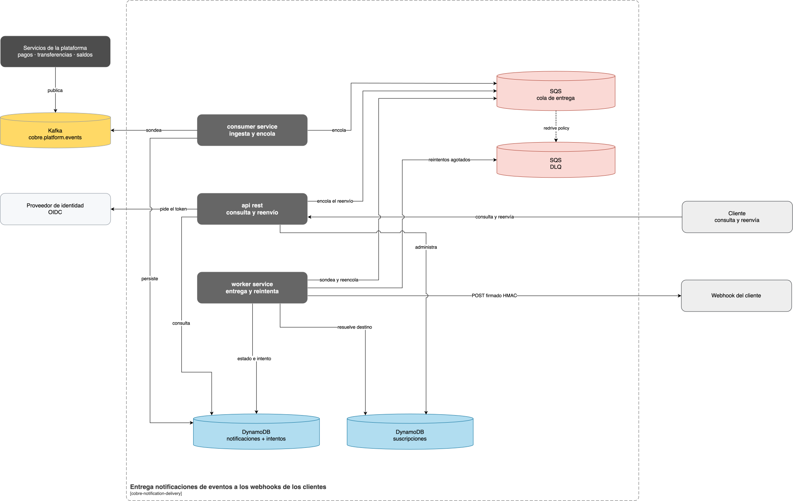
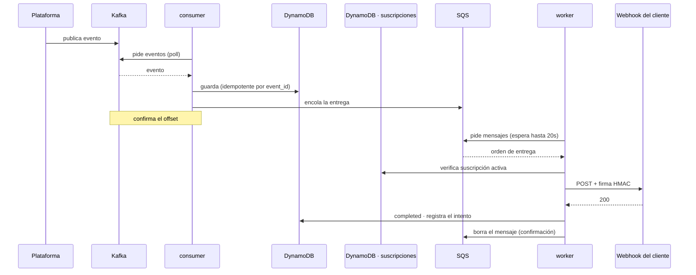
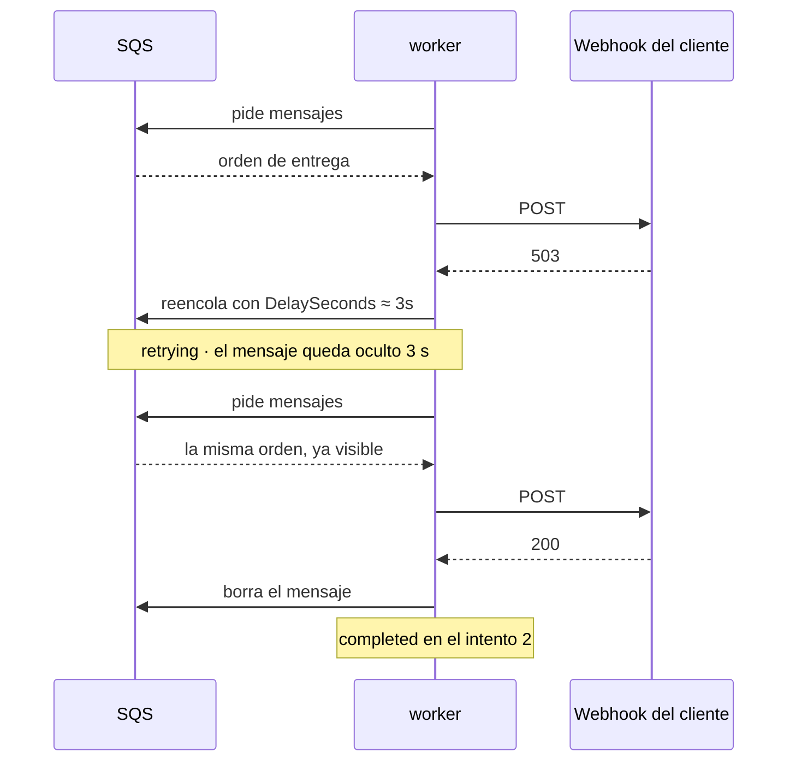
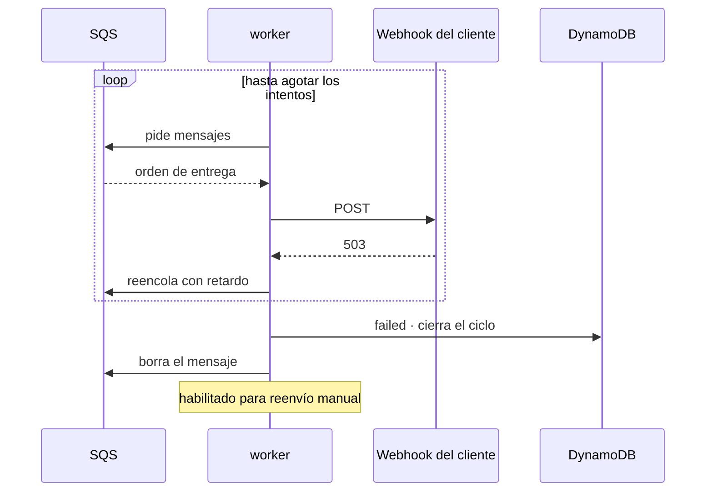
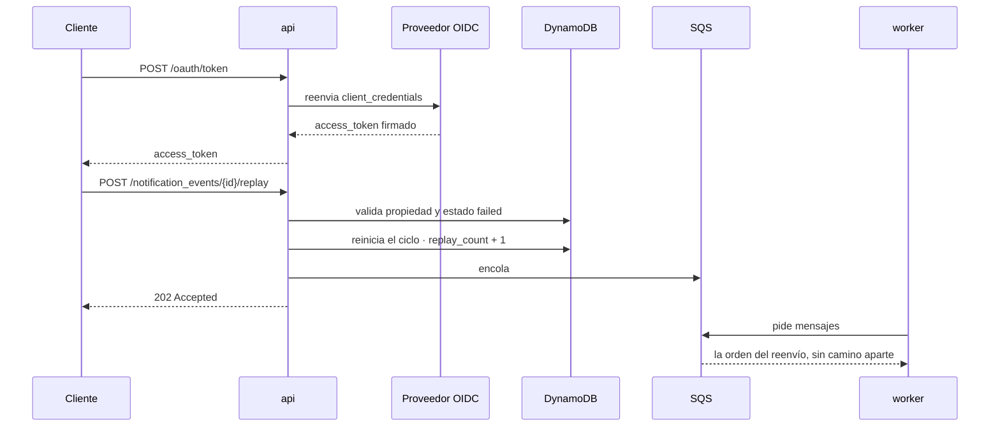

# cobre-notification-delivery

Entrega notificaciones de eventos a los webhooks de los clientes, con reintentos, firma
HMAC y bitácora de cada intento. Expone además una API self-service de consulta y reenvío.

Prueba técnica para Cobre.

```
GET  /notification_events              listado con filtros y paginación
GET  /notification_events/{id}         detalle con la bitácora de cada intento
POST /notification_events/{id}/replay  reenvío de una entrega fallida

POST /subscriptions                    registra el webhook y devuelve su secreto de firma
GET  /subscriptions                    las suscripciones del cliente
```

---

## 1. Arquitectura

[](docs/img/arquitectura.svg)

Ni el bus ni la cola empujan: el `consumer service` y el `worker service` piden con long
polling, y por eso esas flechas salen de ellos. La punteada es el redrive de SQS —tras cinco
entregas fallidas mueve el mensaje solo—, la única que no la origina ningún componente.

> Editable en [`docs/img/Diagrama arquitectura.drawio`](docs/img/Diagrama%20arquitectura.drawio).


Dos caminos. El de la izquierda es automatico: un evento entra por el bus y sale por el
webhook del cliente. El de la derecha lo inicia el cliente cuando consulta o pide un reenvio.
Se cruzan en un solo punto, el `worker`.

Ni el bus ni la cola empujan: el `consumer` y el `worker` piden con long polling. Las lineas
punteadas son los tres ejecutables usando los mismos almacenes; que escribe cada uno esta en
los diagramas de secuencia.

Dentro del recuadro, lo que se despliega y opera aquí: los tres ejecutables, la cola de
trabajo y los almacenes. Fuera, lo que pertenece a otros: el bus de la plataforma, el
proveedor de identidad y el sistema del cliente.

Tres ejecutables sobre una misma librería. El bus y la cola de trabajo cumplen papeles
distintos: Kafka reparte lo que la plataforma publica, y SQS es donde espera cada entrega
pendiente con su reintento programado.

La línea punteada es el redrive de SQS, la única que no origina ningún componente: tras cinco
entregas fallidas mueve el mensaje solo. A la DLQ solo se llega por ahí — un ciclo de reintentos
agotado no va a parar allí, porque se proceso hasta el final y queda registrado como `failed`.

### Tres componentes desplegables

| Componente | Responsabilidad | Señal de escalado |
|---|---|---|
| **consumer** | Ingesta desde el bus y encola la entrega | Retraso del consumidor |
| **worker** | Entrega al webhook y aplica los reintentos | Profundidad de la cola |
| **api** | Consulta y reenvío manual | Peticiones por segundo |

Cada uno se despliega por separado y carga solo las dependencias que usa:

| Componente | Dependencia propia | Lo que no incluye |
|---|---|---|
| `consumer` | `reactor-kafka`, `kafka-clients` | Spring Security |
| `worker` | cliente HTTP reactivo, firma HMAC | Kafka, Spring Security |
| `api` | Spring Security, resource server JWT | Kafka |

### Kafka y SQS

Kafka es el bus de la plataforma: no elimina el mensaje al leerlo, de modo que varios servicios
consumen el mismo evento.

SQS es la cola de trabajo de las entregas. Aporta el retardo por mensaje que implementa el
backoff (`DelaySeconds`) y la cola de mensajes no entregados (DLQ).

En local son Redpanda y ElasticMQ, que hablan los mismos protocolos.

El razonamiento detrás de esta separación está en el [documento de diseño](docs/01-diseno-del-sistema.md#8-propiedades-exigidas-a-la-infraestructura).

---

## 2. Arquitectura hexagonal


| Capa | Qué contiene |
|---|---|
| **Dominio** | El modelo y las reglas: estados, transiciones, política de reintentos. Y los puertos |
| **Aplicación** | Los casos de uso. Orquestan el dominio y los puertos |
| **Infraestructura** | Los adaptadores: Kafka, SQS, REST, DynamoDB, OIDC, WebClient, Micrometer |

Las dependencias apuntan siempre hacia adentro. `DominioSinFrameworkTest` falla el build si el
dominio importa Spring, Kafka o el SDK de AWS.

---

## 3. Escenarios

### 3.1 Entrega exitosa



Ni Kafka ni SQS empujan: el consumidor y el worker piden con *long polling*.

Entrega **al menos una vez**: el offset de Kafka se confirma tras persistir y el mensaje de SQS
se borra tras entregar. La ingesta es idempotente por `event_id` y cada entrega lleva la
cabecera `X-Cobre-Event-Id` para que el receptor descarte repeticiones.

### 3.2 Entrega recuperada tras reintentos



Escalones de espera: **5s · 30s · 2m · 10m · 15m**, cada uno con un componente aleatorio
(*jitter*) de hasta el 20 %.

### 3.3 Reintentos agotados



El evento queda en `failed` con su bitácora completa, y el mensaje se borra de la cola porque
se proceso hasta el final.

**No va a la DLQ.** Esa cola se reserva para lo que la aplicación no pudo procesar —un mensaje
corrupto, una caída a mitad—, y ahí llega solo por el redrive de SQS. Mezclar ambas cosas la
llenaba de eventos que ya tenían desenlace, y quien la mirase reenviaría a mano notificaciones
posiblemente ya entregadas. Separadas, cualquier mensaje en la DLQ significa que algo se rompió
de nuestro lado.

Las respuestas 4xx no llegan aquí: se clasifican como fallo permanente y no se reintentan.

### 3.4 La cola de mensajes no entregados

Guarda contingencias técnicas, no fallos de negocio. Un webhook caído, un 4xx o una suscripción
inexistente terminan en la base como `failed` o `discarded`, con su bitácora y disponibles para
reenvío. Ahí no llegan.

A la DLQ solo va lo que el worker **no pudo procesar**: un mensaje corrupto, el almacén sin
responder, el proceso muriendo a mitad. El mensaje no se confirma, SQS lo reentrega, y a la
quinta lo aparta solo. Sin eso, un mensaje envenenado daría vueltas para siempre.

Por eso su profundidad sirve de alarma: **cualquier mensaje ahí es un fallo propio**.

Devolverlos es decisión humana —en AWS, `start-message-move-task`—. Automatizarlo sería un
bucle: si la causa sigue viva, vuelven a fallar. Es seguro hacerlo, porque el mensaje solo
lleva el identificador y el worker relee el estado antes de actuar.

El riesgo es no mirarla: los mensajes caducan, y un evento cuyo mensaje expiró se queda en
`pending` sin que nada avise.

---

### 3.5 Reenvío manual



Responde **202**: la solicitud queda encolada. La bitácora es de solo adición, así que el
reenvío conserva los intentos del ciclo anterior.

---

## 4. Evidencia

### Traza de una notificación en los logs

Evento que falla en el primer intento y se entrega en el segundo:

```
17:24:34.167            DEBUG        Evento EVT-RECUPERA-README del cliente CLIENT001 aceptado y encolado
17:24:34.181  delivery  INFO   503   Entrega saliente -> 503 en 8ms
17:24:34.193            WARN         Entrega de EVT-RECUPERA-README fallo (intento 1, status 503): reintento en PT3.234S
17:24:37.226  delivery  INFO   200   Entrega saliente -> 200 en 3ms
17:24:37.240            INFO         Notificacion EVT-RECUPERA-README entregada al cliente CLIENT001 en el intento 2
```

`PT3.234S` son 3,234 segundos en formato ISO-8601. Cada línea lleva `event_id`, `client_id` y
`request_id` como campos indexados. El `content` de la notificación no se registra.

### Consulta de los logs en Kibana

Los logs se indexan en Elasticsearch y se consultan desde Kibana con cinco vistas
versionadas en el repositorio: todo el tráfico, entregas, llamadas a la API, solo errores y
traza de un evento. Se cargan con `./scripts/kibana-import.sh`.

### Métricas en Grafana


Dos alarmas provisionadas desde el repositorio, en la carpeta «Alarmas de entrega»:

| Alarma | Dispara | Severidad |
|---|---|---|
| Tasa de error de entrega alta | Más del 20 % fallando, sostenido 5 min | crítica |
| Cliente con entregas fallando | Un destino concreto rechazando 10 min | aviso |

La primera señala un problema propio; la segunda, un cliente al que conviene avisar antes de
que se le agoten los reintentos. Falta conectarles un canal de notificación, que depende de
dónde reciba avisos la guardia.

Paneles: entregadas, fallidas, reintentos exitosos, reintentos agotados, reenvíos manuales,
errores por código, latencia del webhook, clientes con entregas fallando y timeouts.

### Listado paginado por cursor

```json
{ "data": [ … ], "size": 20, "next_cursor": "c2sJTUVUQQpwawlFVkVOVCNF…", "has_next": true }
```

Se devuelve el `next_cursor` tal como llegó para pedir la página siguiente. Los detalles, en
la [guía de uso](docs/03-guia-de-uso.md#listado-de-notificaciones).

### Bitácora devuelta por la API

```json
{
  "event_id": "EVT-RECUPERA-README",
  "delivery_status": "completed",
  "attempts": 2,
  "delivery_attempts": [
    { "attempt_number": 2, "outcome": "delivered",         "http_status": 200, "duration_ms": 3 },
    { "attempt_number": 1, "outcome": "retryable_failure", "http_status": 503, "duration_ms": 9 }
  ]
}
```

### Pruebas

190 pruebas, sin fallos. Cobertura agregada de los cuatro módulos: 94,5 % de instrucciones
y 94,6 % de líneas. El build falla si desciende del 90 %.

---

## 5. Ejecución

Requisitos: Docker. Nada más — ni Java ni Gradle instalados.

Todos los comandos se ejecutan desde la raíz del repositorio, la carpeta que contiene
`docker-compose.yml`:

```bash
git clone https://github.com/ssalaza7/cobre-notification-delivery.git
cd cobre-notification-delivery
```

```bash
# 1. Variables de entorno. La plantilla trae valores validos para local.
cp .env.example .env
set -a; source .env; set +a

# 2. Todo: infraestructura, los tres servicios, observabilidad y consolas
docker compose --profile apps --profile observability up -d --build
```

La primera vez tarda unos minutos construyendo las tres imágenes. Después, segundos.

```bash
docker compose --profile apps --profile observability ps      # qué está arriba
```

### Probar

La API queda en **http://localhost:8080**. Importar
[la colección de Postman](postman/) y ejecutarla de arriba abajo. Crea su propio
destino en webhook.site, registra el webhook, publica eventos y consulta el resultado. No hay
que preparar nada.

```bash
npx newman run postman/cobre-notification-delivery.postman_collection.json
```

### Ver qué pasa

| Dónde | URL | Qué se ve |
|---|---|---|
| **Grafana** | http://localhost:3000 | Entregas, reintentos, latencia, clientes fallando |
| **Kibana** | http://localhost:5601 | La traza de cada notificación. Vistas: `./scripts/kibana-import.sh` |
| **Kafka** | http://localhost:8085 | El topic, sus mensajes y el grupo de consumo |
| **SQS** | http://localhost:9325 | La cola de entrega y la DLQ, con su profundidad |
| **Base de datos** | http://localhost:8086 | Las tablas de DynamoDB y sus ítems |
| **Identidad** | http://localhost:8087 | Clientes y alcances en Keycloak (`admin` / `admin`) |

### Empezar de cero

Antes de un ensayo o de una demostración, para que los tableros no arrastren datos de pruebas
anteriores. Logs y métricas viven en sistemas distintos, así que hay que limpiar los dos:

```bash
# 1. Detener lo que escribe y lo que lee
docker compose --profile apps stop consumer worker api
docker compose --profile observability stop filebeat

# 2. Borrar logs: indice de Elasticsearch, archivos locales, historial de Prometheus
curl -X DELETE "http://localhost:9200/_data_stream/cobre-notifications*"
rm -f logs/*
docker compose --profile observability rm -sf filebeat prometheus

# 3. Borrar datos: notificaciones, suscripciones y colas
docker compose rm -sfv dynamodb elasticmq

# 4. Levantar de nuevo. Las tablas se recrean y se siembran solas
docker compose --profile apps --profile observability up -d
```

El orden importa: borrar los archivos con los servicios corriendo no los cierra, y siguen
escribiendo a un archivo que ya no existe hasta que se reinician.

Para dejarlo todo en blanco de una vez, incluidos los clientes de identidad, basta con
`down -v` y volver a levantar.

### Apagar

```bash
# Detener, conservando los datos
docker compose --profile apps --profile observability down

# Detener y borrar tambien DynamoDB, las colas y el realm de identidad
docker compose --profile apps --profile observability down -v
```

El perfil `local` acorta los escalones de reintento para poder verlos completos y admite
destinos HTTP. En cualquier otro perfil se exige HTTPS y se bloquean las direcciones internas.

---

## 6. Documentación

| Documento | Contenido |
|---|---|
| [Diseño del sistema](docs/01-diseno-del-sistema.md) | Task 1 — escalabilidad, resiliencia, despliegue |
| [Seguridad OWASP](docs/02-seguridad-owasp.md) | Task 3 — vulnerabilidades identificadas y mitigaciones |
| [Guía de uso](docs/03-guia-de-uso.md) | Registro de webhooks, tokens, Postman, consolas, receptor de pruebas |
| [Spec de reconstrucción](docs/04-spec-de-reconstruccion.md) | Qué construir y bajo qué restricciones, para levantarlo desde cero |

---

## 7. Trade-offs

Los tres que más definen el sistema. El resto, con su alternativa y cuándo se revisaría, en el
[documento de diseño](docs/01-diseno-del-sistema.md#14-trade-offs).

| Decisión | Alternativa | Por qué esta |
|---|---|---|
| **Kafka como bus, SQS como cola de trabajo** | Solo Kafka | Kafka no tiene retardo por mensaje, y su orden por partición deja que un webhook lento bloquee a los demás clientes |
| **DynamoDB para eventos e intentos** | PostgreSQL para todo | El flujo solo accede por `event_id` y lista por cliente y fecha: ambas son consultas por clave, y la bitácora crece sin techo |
| **Entrega al menos una vez** | Confirmar antes de procesar | Un duplicado que el cliente descarta cuesta menos que un pago no notificado |

---

## 8. Limitaciones conocidas

1. **No hay circuit breaker por cliente.**
2. **El límite de tasa es por instancia**, no global.
3. **No hay pruebas de integración con infraestructura real.** Pendiente: Testcontainers.
4. **El secreto de firma del webhook se almacena en texto plano.** Pendiente: cifrarlo con KMS.
5. **La DLQ no tiene reproceso automático** ni alarma por profundidad.

---

```bash
docker compose --profile observability down
```
