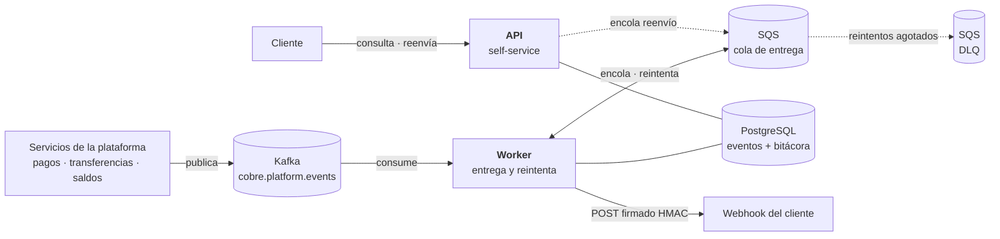
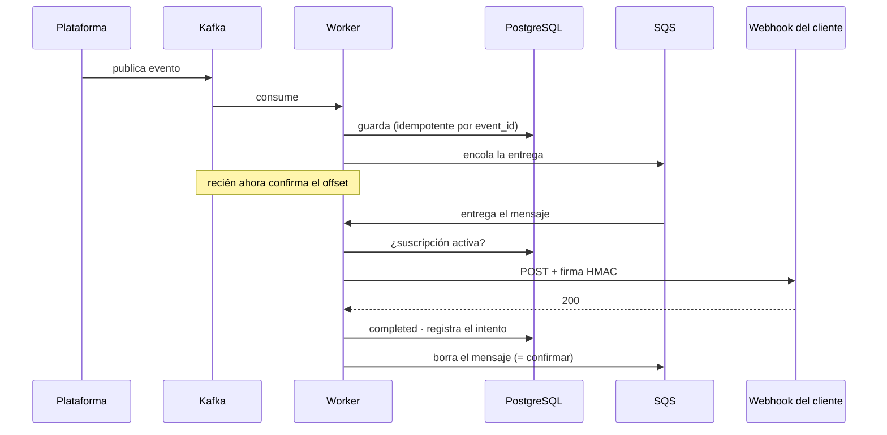
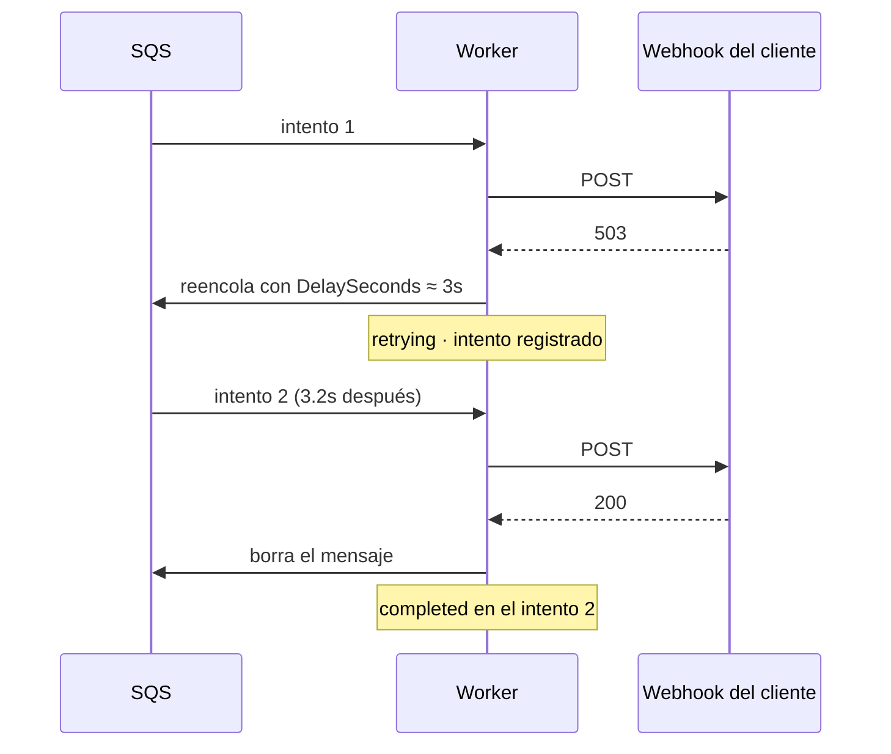
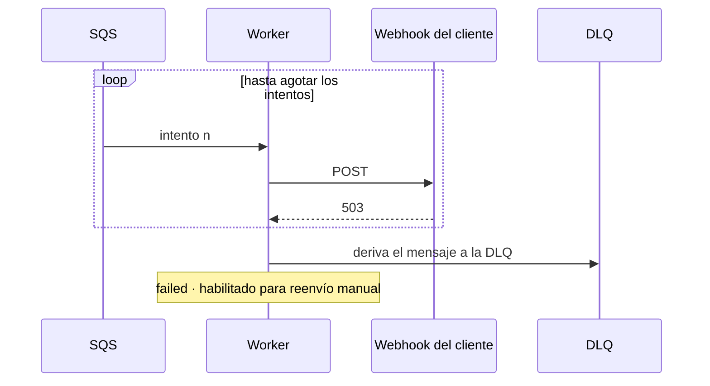
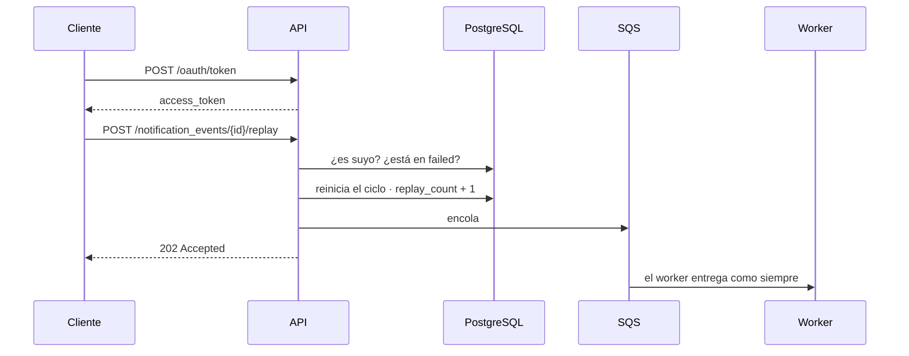

# notification-delivery-service

Entrega notificaciones de eventos a los webhooks de los clientes —con reintentos, firma y
bitácora— y expone una API para que el cliente consulte y reenvíe las suyas.

Prueba técnica para **Cobre**. Funciona de punta a punta; este README lo demuestra con
evidencia real, no con descripciones.

```
GET  /notification_events              listado con filtros y paginación
GET  /notification_events/{id}         detalle con la bitácora de cada intento
POST /notification_events/{id}/replay  reenvío de una entrega fallida
```

---

## 1. Cómo está armado



**Dos protagonistas, y hacen cosas distintas.**

| | Qué hace | Carga |
|---|---|---|
| **Worker** | Consume de Kafka, entrega al webhook, reintenta, y rinde a la DLQ lo que no logró | Toda la que genere la plataforma |
| **API** | Responde consultas y acepta reenvíos | La que generen las personas |

Por eso son **despliegues independientes**: escalar el worker en una tormenta de eventos
no debería obligar a pagar réplicas de una API que nadie está usando. La misma imagen
arranca como uno u otro según la variable `COBRE_ROLE`.

**Por qué dos sistemas de mensajería y no uno**

Kafka es el **bus**: la plataforma publica ahí sus eventos y cualquier servicio los lee.
No borra al leer, así que otros equipos consumen lo mismo sin estorbarse.

SQS es la **cola de trabajo**: ahí vive el pendiente de entregar. Se eligió porque el
paralelismo de Kafka lo topan las particiones —diez réplicas sobre tres particiones dejan
siete sin hacer nada—, mientras que en SQS cada consumidor toma el siguiente mensaje
libre. Además trae de fábrica lo que la entrega necesita: retardo por mensaje
(`DelaySeconds`, el backoff) y **DLQ** con política de reintentos.

En local son **Redpanda** y **ElasticMQ**: hablan los mismos protocolos, así que el código
es idéntico al que correría contra Confluent Cloud y AWS. Solo cambian las direcciones.

---

## 2. Arquitectura hexagonal

```
domain/          modelo puro · CERO imports de framework
application/     port/in · port/out · casos de uso
infrastructure/  adaptadores: REST · Kafka · SQS · R2DBC · WebClient · Micrometer
```

Las dependencias apuntan **siempre hacia adentro**. `domain` y `application` no importan
una sola clase de Spring; todo el cableado vive en `infrastructure/config`.

**Cómo se comprueba sin creerme:** las pruebas del dominio y de los casos de uso corren
sin contexto de Spring, sin base de datos y sin broker. Si alguna capa interna hubiera
tocado el framework, no compilarían así.

Lo que compra en la práctica: se quitó RabbitMQ y se puso Kafka + SQS **sin tocar una
línea del dominio ni de los casos de uso**. Se reescribieron adaptadores y nada más.

---

## 3. Los cuatro escenarios

### 3.1 Entrega exitosa



El orden importa: **el offset de Kafka se confirma después de persistir**, y el mensaje de
SQS **se borra después de entregar**. Si el proceso muere en cualquier punto intermedio,
nadie confirmó nada y el evento vuelve a entregarse.

**Qué implica eso.** Que una notificación pueda llegarle al cliente dos veces. Es una
decisión, no un descuido, y la alternativa es peor: si se confirmara *antes* de trabajar,
un proceso que muere a mitad se llevaría el evento consigo y **nadie se enteraría nunca**.
En notificaciones de pagos, un mensaje repetido que el cliente descarta cuesta mucho menos
que un pago del que nunca se le avisó.

El duplicado no queda suelto. La ingesta es idempotente por `event_id`: un evento repetido
no crea un registro nuevo. Y cada entrega viaja con la cabecera `X-Cobre-Event-Id`, con la
que el cliente descarta lo que ya procesó.

### 3.2 Entrega con reintentos, recuperada



Las esperas crecen: **5s · 30s · 2m · 10m · 15m**. Ningún escalón pasa de 15 minutos porque
ese es el tope de `DelaySeconds` en SQS.

**Y encima llevan jitter.** El escalón configurado es de 3 segundos exactos, pero la espera
real acaba siendo 3,234s. Ese sobrante aleatorio es el jitter, y resuelve un problema
concreto: si el webhook de un cliente se cae un minuto, sus 200 notificaciones pendientes
fallan casi a la vez, y sin jitter las 200 reintentarían en el mismo segundo. Ese golpe lo
vuelve a tumbar justo cuando se estaba levantando. Sumándole a cada espera un porcentaje
aleatorio (hasta 20%), las 200 se reparten en una ventana en vez de caer juntas.

### 3.3 Reintentos agotados



La **DLQ** (*dead letter queue*, cola de mensajes no entregados) es donde va a parar lo que
agotó sus intentos. No es un basurero: es una bandeja de revisión. No se pierde nada — el
evento queda en `failed` con toda su bitácora y el mensaje queda ahí para inspección.
**La API de reenvío existe justamente para este estado.**

Una URL inválida no llega aquí: si el webhook no es HTTPS o apunta a la red interna, es un
fallo **permanente** y falla al primer intento. Insistir no lo va a arreglar.

### 3.4 Reenvío manual desde la API



**202 y no 200**: quedó encolado, no entregado. Repetir la llamada devuelve `409`, porque
ya no está en fallo definitivo.

La bitácora es **append-only**: el reenvío no borra los intentos anteriores. Después de un
reenvío exitoso el detalle muestra 4 intentos en 2 ciclos, no 1 intento.

---

## 4. Evidencia

### 4.1 Una notificación completa, en los logs

Traza real de un evento que falló y se recuperó. Son **seis líneas**, no sesenta:

```
17:24:34.167            DEBUG        Evento EVT-RECUPERA-README del cliente CLIENT001 aceptado y encolado
17:24:34.181  delivery  INFO   503   Entrega saliente -> 503 en 8ms
17:24:34.193            WARN         Entrega de EVT-RECUPERA-README fallo (intento 1, status 503): reintento en PT3.234S
17:24:37.226  delivery  INFO   200   Entrega saliente -> 200 en 3ms
17:24:37.240            INFO         Notificacion EVT-RECUPERA-README entregada al cliente CLIENT001 en el intento 2
```

`PT3.234S` es cómo Java escribe una duración: **3,234 segundos**. Ese decimal es el jitter.

Cada línea lleva `event_id`, `client_id` y `request_id` **como campos indexados**: una sola
consulta reconstruye el ciclo completo de una notificación, aunque sus intentos ocurran con
minutos de diferencia y en hilos distintos.

**El `content` de la notificación nunca se registra**: es dato financiero del cliente.

### 4.2 Lo mismo visto en Kibana


Las vistas vienen versionadas en [`observability/kibana/vistas.ndjson`](observability/kibana/vistas.ndjson)
y se cargan con un comando, así que no hay que armarlas a mano ni se pierden al recrear el
contenedor:

```bash
./scripts/kibana-import.sh
```

Quedan cinco, en *Discover → Open*: todo el tráfico · entregas · llamadas a la API · solo
errores · traza de un evento.

### 4.3 Las métricas en Grafana


| Panel | Para qué sirve |
|---|---|
| Entregadas · Fallidas | El resultado neto |
| **Reintentos exitosos** | Las que fallaron y se recuperaron solas. Es el número que justifica toda la estrategia: sin reintentos, perdidas |
| **Reintentos agotados** | Las que fallaron hasta el final. Requieren intervención |
| Reenvíos manuales | Si crece, algo estructural está roto |
| **Errores por código** | Un 5xx es transitorio; un 4xx es contrato roto |
| **Latencia del webhook** | p50 · p95 · p99. Es lo primero que se degrada, antes de los timeouts |
| A la primera vs. recuperadas | Si la franja de recuperadas crece, los destinos se están degradando aunque el resultado final siga bien |
| **Clientes con entregas fallando** | **Qué** cliente se cayó, no solo cuántas entregas fallaron |
| **Sin respuesta del cliente** | Timeouts y conexiones rechazadas. El destino ni contestó: el problema está en la red o en un servidor que no acepta conexiones, no en cómo respondió su aplicación |
| Tiempo de respuesta promedio | La tendencia general, al lado de los percentiles |

### Sobre `client_id` como etiqueta

**Solo una métrica lo lleva**, `cobre_notification_client_failures_total`, y es deliberado
en los dos sentidos.

Etiquetar *todas* las métricas por cliente multiplica las series de tiempo por el número de
clientes. Con miles, eso tumba a Prometheus, y en Datadog cada combinación de etiquetas se
factura.

Pero no tenerlo en *ninguna* deja a guardia sin poder responder la primera pregunta de un
incidente: **¿qué cliente se cayó?** Habría que ir a los logs, que es más lento justo cuando
el tiempo importa, y no se podría alertar automáticamente.

La salida es acotarlo al fallo. **La serie solo nace cuando un cliente falla**, así que la
cota no son todos los clientes: son los que están fallando ahora mismo, que en un sistema
sano son unos pocos. Con eso se monta la alerta que importa —*"CLIENT002 lleva 5 minutos
fallando"*— y guardia sabe a quién llamar sin abrir Kibana.

### 4.4 La bitácora que devuelve la API

```json
{
  "event_id": "EVT-RECUPERA-README",
  "delivery_status": "completed",
  "attempts": 2,
  "replay_count": 0,
  "delivery_attempts": [
    { "attempt_number": 2, "outcome": "delivered",         "http_status": 200, "duration_ms": 3 },
    { "attempt_number": 1, "outcome": "retryable_failure", "http_status": 503, "duration_ms": 9,
      "error_message": "El webhook respondio 503" }
  ]
}
```

### 4.5 Aislamiento entre clientes

`EVT005` es de `CLIENT003`. Con un token de `CLIENT002`:

```bash
curl -s -o /dev/null -w "%{http_code}\n" -H "Authorization: Bearer $TOKEN" \
  http://localhost:8080/notification_events/EVT005
# 404
```

**404 y no 403.** Un 403 confirmaría que el recurso existe y permitiría enumerar
identificadores ajenos. Hacia afuera, "no existe" y "no es tuyo" son indistinguibles.

### 4.6 Pruebas

```bash
./gradlew clean build
```

**196 pruebas, 0 fallos.** Cobertura **94.5% instrucciones / 94.6% líneas**; el build falla
si baja del 90%. Reporte en `build/reports/jacoco/test/html/index.html`.

El adaptador de webhooks se prueba contra un **servidor HTTP real** del JDK, no contra un
mock: lo que hay que verificar ahí es comportamiento de red —timeouts, conexiones
rechazadas, redirecciones— que un mock daría por supuesto.

---

## 5. Cómo correr

**Requisitos:** Docker y Java 21 (si no lo tienes, Gradle lo descarga solo). Gradle no hace
falta instalarlo: usa `./gradlew`.

```bash
# 1. Secreto. La aplicación NO arranca sin él, a propósito.
cp .env.example .env
openssl rand -base64 48          # pega el resultado en JWT_SECRET
set -a; source .env; set +a

# 2. Infraestructura: Postgres, Kafka (Redpanda), SQS (ElasticMQ)
docker compose up -d

# 3. Un receptor de webhooks que hace de cliente y verifica la firma
python3 scripts/webhook-receiver.py

# 4. La aplicación
SPRING_PROFILES_ACTIVE=local ./gradlew bootRun
```

No hay ningún secreto en el código. `JWT_SECRET` no tiene valor por defecto porque un
secreto commiteado queda en el historial de git para siempre, aunque después se borre. En
AWS se inyecta desde **Secrets Manager**, que permite rotarlo sin redesplegar.

Las contraseñas de Postgres y de los emuladores sí tienen valor por defecto, y es
deliberado: son contenedores locales desechables que no dan acceso a nada. Tratarlas como
secretos sería teatro.

El perfil `local` acorta los reintentos a 3s · 6s · 10s para poder verlos completos, y
permite webhooks HTTP hacia `localhost`. **En cualquier otro perfil se exige HTTPS y se
bloquean destinos internos.**

### Dispararlo

```bash
./scripts/publish-event.sh EVT-DEMO-1 CLIENT001 credit_transfer "Transferencia por 1.500.000"
```

Los tres clientes de demostración ya vienen con su webhook apuntando al receptor local.
Para registrar otros, ver [§7](#7-registrar-webhooks).

### El receptor de pruebas y sus patrones

`scripts/webhook-receiver.py` **hace de cliente**: recibe la notificación, verifica la firma
y responde. No es parte del sistema — simula el sistema del cliente, que es quien de verdad
decide si acepta o rechaza.

Hay que poder mostrar varios comportamientos —entrega limpia, reintentos, fallo definitivo,
timeout— y reiniciar el receptor con otra bandera entre uno y otro corta el hilo de una
presentación. Por eso **el receptor mira el identificador del evento y decide cómo
responder**. Con una sola instancia corriendo, el escenario se elige al publicar:

| Si publicas | El receptor responde | Qué demuestra |
|---|---|---|
| `EVT-DEMO-1` | 200 | Entrega exitosa a la primera |
| `EVT-RECUPERA-1` | 503, después 200 | El backoff recupera la entrega |
| `EVT-FALLA-1` | 503 siempre | Se agotan los reintentos: queda `failed` y va a la DLQ |
| `EVT-RECHAZA-1` | 400 | Contrato roto: **no se reintenta**, insistir daría el mismo 400 |
| `EVT-LENTO-1` | no contesta a tiempo | Timeout: el destino ni respondió |

Es una convención **del receptor de pruebas**, no del servicio. El servicio trata todos los
eventos igual; el que decide es el destino.

### Un token

Acepta los dos formatos de cuerpo. El primero es el del estándar:

```bash
curl -X POST http://localhost:8080/oauth/token \
  -H 'Content-Type: application/x-www-form-urlencoded' \
  -d 'grant_type=client_credentials&client_id=CLIENT002&client_secret=demo-secret-client002'
```

```bash
TOKEN=$(curl -s -X POST http://localhost:8080/oauth/token \
  -H 'Content-Type: application/json' \
  -d '{"grant_type":"client_credentials","client_id":"CLIENT002","client_secret":"demo-secret-client002"}' \
  | python3 -c "import sys,json;print(json.load(sys.stdin)['access_token'])")
```

| client_id | client_secret | scopes |
|---|---|---|
| `CLIENT001` | `demo-secret-client001` | read · replay · monitor |
| `CLIENT002` | `demo-secret-client002` | read · replay · monitor |
| `CLIENT003` | `demo-secret-client003` | **solo read** |

`CLIENT003` no puede reenviar a propósito: consultar y reenviar son autorizaciones
distintas.

**Por qué `POST` y no `GET`.** Un `GET` llevaría el `client_secret` en la URL, y las URLs no
se quedan donde uno cree: van al log de acceso del balanceador, al historial del navegador,
a la cabecera `Referer` y a cualquier proxy intermedio — todos fuera de nuestro control.
Es además lo que exige el RFC 6749 para `client_credentials`, y la forma en que lo piden
las pasarelas de pago del mercado.

**Y aparte, los logs enmascaran.** Que nosotros no pongamos secretos en la URL no impide
que un cliente lo haga por error al integrar. El log de acceso tapa el valor de cualquier
parámetro sensible antes de escribirlo:

```
GET /notification_events?size=1&client_secret=***&access_token=***
```

Se conserva el **nombre** del parámetro a propósito: saber que alguien mandó un
`client_secret` por la URL es justo lo que permite avisarle de que corrija la integración.
Un secreto que llega al índice no se puede "desfiltrar": queda replicado en cada backup y
obliga a rotarlo.

### Las consolas

```bash
docker compose --profile observability up -d
```

> Regenerar las imágenes de este README necesita además el renderizador, que está en su
> propio perfil (`--profile evidencia`). Levanta un Chromium con picos de memoria fuertes
> al renderizar, y no hace falta para nada durante una demostración.

| Consola | URL |
|---|---|
| **Grafana** — el tablero ya viene cargado | http://localhost:3000 |
| **Kibana** — las vistas se cargan con `./scripts/kibana-import.sh` | http://localhost:5601 |
| **SQS** — la cola de entrega y la DLQ | http://localhost:9324 |
| **Prometheus** — las métricas en crudo | http://localhost:9091 |

> **Cómo llega el dato a cada consola.** La aplicación **no le envía métricas a nadie**:
> las publica en `/actuator/prometheus`, que es una foto del instante. Prometheus **va y
> consulta ese endpoint cada 5 segundos, y guarda cada lectura** —como un lector de medidor
> que pasa a anotar la cifra, en vez de que el medidor lo llame—. Grafana no habla con la
> aplicación: le pregunta a Prometheus, que es quien tiene el histórico.
>
> Con los logs es al revés en el último tramo: la aplicación escribe JSON, **Filebeat lo lee
> y lo envía** a Elasticsearch, y Kibana consulta ahí.
>
> En los dos casos **la aplicación no conoce el destino final**. Por eso cambiar Prometheus
> por Datadog no toca una línea de código: el agente de Datadog consulta exactamente el
> mismo endpoint. Está cableado y apagado por defecto porque necesita cuenta y API key.

---

## 6. Colección de Postman

En [postman/](postman/), en tres carpetas y siete peticiones. Solo lo que un cliente hace de
verdad: nada de casos inventados.

| Carpeta | Peticiones | Qué demuestra |
|---|---|---|
| **1 · Flujo exitoso** | 1 | Publicar el evento. **Es lo único que se hace**: el resto es autónomo |
| **2 · Flujo con reintento** | 1 | Publicar un evento cuyo destino rechaza. Los reintentos aparecen solos |
| **3 · API self-service** | 5 | Token, listado, detalle, reenvío, detalle otra vez |

Las peticiones encadenan variables: el token se guarda al obtenerlo y el id de la
notificación fallida se captura del listado.

---

## 7. Registrar webhooks

Un cliente puede tener **varios**: uno por tipo de evento, más un comodín `*` que recoge
todo lo demás. Es lo que permite mandar las transferencias a un sistema y las alertas de
saldo a otro sin duplicar configuración. Al entregar, **gana el tipo específico sobre el
comodín**.

### Registrar uno

```bash
./scripts/register-webhook.sh CLIENT001 https://mi-sistema.com/webhooks
```

```
Webhook registrado.
  cliente : CLIENT001
  eventos : *
  destino : https://mi-sistema.com/webhooks

  Secreto de firma (se muestra una sola vez):
    whsec_H6foh8fFGCR1AAVdbUFvo2J3KAzFjHDFGCF6Dmcq
```

El secreto **se muestra una sola vez**, al crearlo. Con él el cliente verifica la cabecera
`X-Cobre-Signature` de cada notificación: es lo que le permite saber que el mensaje viene de
nosotros y no de alguien que descubrió su URL.

### Varios destinos para el mismo cliente

```bash
./scripts/register-webhook.sh CLIENT001 https://pagos.mi-sistema.com/hooks credit_transfer
./scripts/register-webhook.sh CLIENT001 https://alertas.mi-sistema.com/hooks balance_updated
```

```
  cliente  | tipo_de_evento  |                destino                 | activo
-----------+-----------------+----------------------------------------+--------
 CLIENT001 | balance_updated | https://alertas.mi-sistema.com/hooks   | si
 CLIENT001 | credit_transfer | https://pagos.mi-sistema.com/hooks     | si
 CLIENT001 | *               | https://mi-sistema.com/webhooks        | si
```

Ahora las transferencias van a `pagos`, las alertas de saldo a `alertas`, y **cualquier
otro tipo** cae en el comodín.

### Cambiar el destino

El mismo comando con otra URL. **El secreto de firma no cambia**: rotarlo en cada cambio de
URL rompería la verificación del cliente sin avisarle.

```bash
./scripts/register-webhook.sh CLIENT001 https://nuevo-dominio.com/hooks credit_transfer
```

### Ver y dar de baja

```bash
./scripts/register-webhook.sh --list CLIENT001
./scripts/register-webhook.sh --off  CLIENT001 credit_transfer
```

La baja **no borra la fila**, la desactiva: la bitácora de lo ya entregado apunta a ella y
borrarla dejaría el historial huérfano.

Todo aplica **desde la siguiente notificación**. No hay que reiniciar nada: el servicio
consulta la suscripción en cada entrega.

### Alternativa: variable de entorno

Para redirigir **todos** los webhooks a un mismo destino sin tocar la base —útil cuando la
URL de prueba se conoce el mismo día:

```bash
WEBHOOK_OVERRIDE_URL=https://el-destino-que-me-dieron/webhook \
java -jar build/libs/notification-delivery-service-0.0.1-SNAPSHOT.jar
```

Tiene precedencia sobre lo que haya en la base. Arranca en 3 segundos, así que cambiar de
destino es reiniciar y seguir.

### Qué se valida al entregar

Sin el perfil `local`, la validación va en modo estricto: **se exige HTTPS** y se rechazan
destinos que resuelvan a la red interna (`169.254.169.254`, rangos privados, loopback). Sin
eso, el servicio sería un proxy: cualquiera podría registrar una URL interna y conseguir que
Cobre haga esa petición desde dentro de su red. Es SSRF, y aquí importa especialmente porque
**la URL destino la elige el cliente, no nosotros**.

Verificado contra un endpoint HTTPS público real (`postman-echo.com`): entregado en 1
intento. El mismo destino en `http://`: `failed` en 1 intento, *"El webhook debe usar
HTTPS"*. Un solo intento porque una URL inválida es un fallo permanente — insistir no la va
a arreglar.

---

## 8. Documentación

| Documento | Contenido |
|---|---|
| [Diseño del sistema](docs/01-diseno-del-sistema.md) | **Task 1** — C4, escalabilidad, resiliencia, despliegue |
| [Seguridad OWASP](docs/02-seguridad-owasp.md) | **Task 3** — 5 vulnerabilidades con su mitigación implementada |

---

## 9. Limitaciones conocidas

Dichas antes de que las pregunten:

1. **Sin circuit breaker por cliente.** Un webhook caído horas sigue gastando 5 intentos por
   evento.
2. **El rate limit es por instancia.** Existe y funciona —protege el endpoint de token, que
   es el más expuesto a fuerza bruta— pero cada réplica cuenta por su lado: con 3 réplicas,
   el límite efectivo es el triple. Contiene el abuso accidental, no el deliberado. Para
   que fuera global haría falta un contador compartido (Redis), y en AWS este control
   pertenece al WAF, antes de llegar a la aplicación.
3. **Sin pruebas de integración con infraestructura real.** Los adaptadores de persistencia
   y el cableado de beans están fuera del gate de cobertura porque no se pueden verificar
   sin una base real. Hoy se cubren con la verificación manual documentada arriba; el paso
   pendiente es **Testcontainers**, que levanta Postgres y los brokers de verdad dentro del
   build.
4. **Los secretos de firma están en texto plano en la base.**

   Hay dos secretos distintos y conviene no confundirlos. El **`client_secret`**, con el
   que el cliente pide su token, se guarda *hasheado* con bcrypt: nadie —ni con acceso a
   la base— puede recuperarlo, solo verificar si el que le presentan coincide.

   El **secreto de firma del webhook** no puede hashearse, porque hay que usarlo: en cada
   entrega se calcula un HMAC del cuerpo con él, y para eso el valor original tiene que
   estar disponible. Hoy está en la columna tal cual, y quien lea la base puede firmar
   notificaciones falsas que el cliente aceptaría como legítimas.

   **La mitigación es cifrarlo con KMS** (el servicio de llaves de AWS): se guarda el
   secreto cifrado y la llave que lo descifra vive en KMS, no en la base. Quien se lleve un
   volcado de la base se lleva texto cifrado inútil, y además cada uso de la llave queda
   registrado en CloudTrail, así que un acceso anómalo se ve.
5. **La DLQ no tiene proceso automático** de reproceso ni alarma por profundidad. Hoy se
   revisa a mano; debería tener una alarma cuando crece.
6. **Emisor de tokens propio.** Suficiente y autocontenido para la prueba, pero en
   producción esto es un proveedor OIDC con validación por JWKS y rotación de claves.

---

## Apagar todo

```bash
docker compose --profile observability down
```
