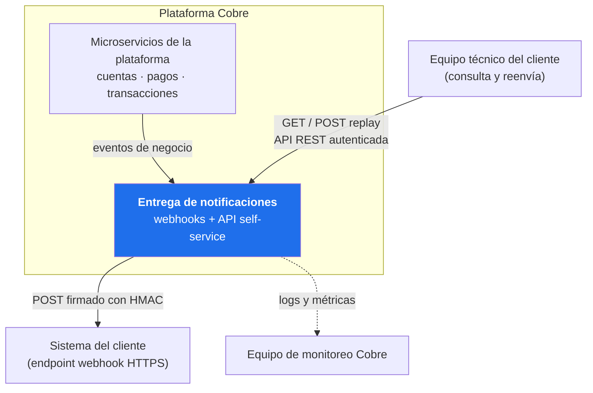
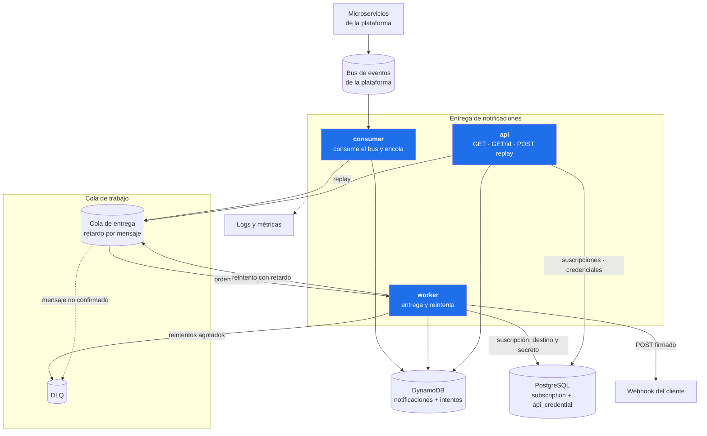
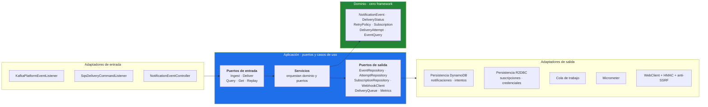
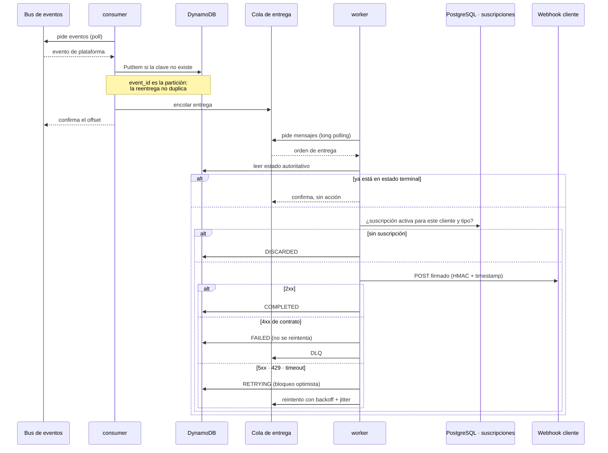
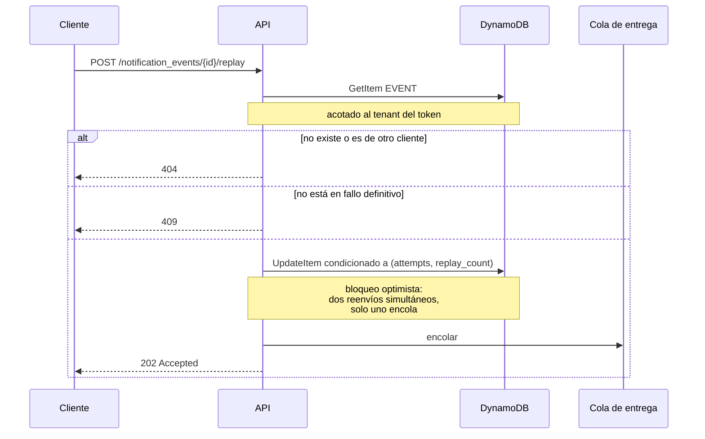
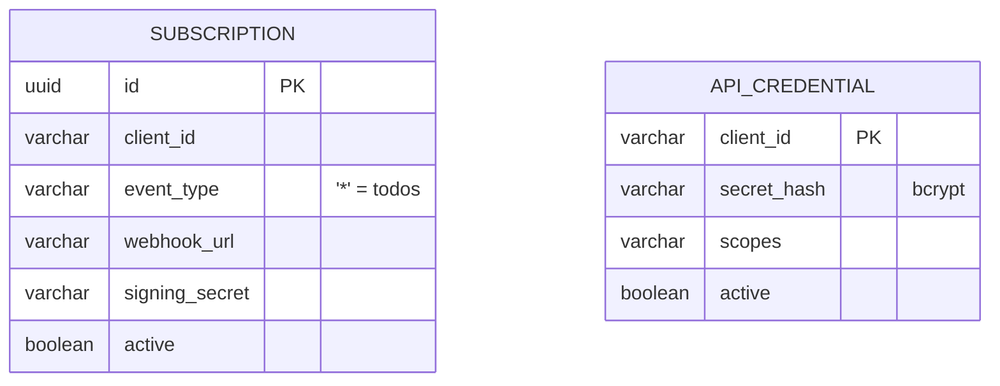
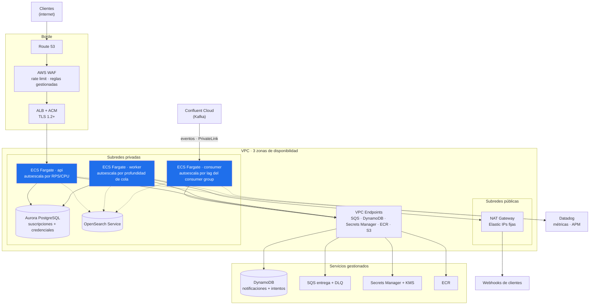

# Task 1 — Diseño del sistema

Entrega de notificaciones de eventos por webhook, con una API self-service de consulta y
reenvío.

El enunciado pide garantizar escalabilidad y resiliencia sin fijar nube, broker ni base de
datos. El documento se organiza en consecuencia: las **secciones 1 a 8** contienen el diseño
—estructura, garantías y propiedades exigidas a la infraestructura— con independencia de
productos concretos; la **sección 9** presenta una materialización en AWS. La sección 8 es la
bisagra entre ambas.

---

## 1. Alcance

Cada evento que genera la plataforma debe llegar al webhook del cliente al que pertenece, sin
perderse cuando el destino falla, y dejando registro suficiente para responder una reclamación
con datos.

Son dos capacidades sobre un mismo modelo: **entrega** (consumir, verificar suscripción,
entregar, reintentar, registrar) y **self-service** (registrar el webhook, consultar, ver
detalle, reenviar).

```
POST /oauth/token                      emisión de token
POST /subscriptions                    registra el webhook y devuelve su secreto de firma
GET  /subscriptions                    las suscripciones del cliente
GET  /notification_events              listado con filtros y paginación
GET  /notification_events/{id}         detalle con la bitácora de cada intento
POST /notification_events/{id}/replay  reenvío de una entrega fallida
```

---

## 2. Contexto (C4 nivel 1)



El servicio no interpreta el significado de un `credit_transfer` ni valida reglas de negocio
del evento. Su responsabilidad comienza cuando el evento ya ocurrió y termina cuando la
entrega queda cerrada y registrada.

---

## 3. Contenedores (C4 nivel 2)



Las líneas punteadas son telemetría: la aplicación escribe a stdout y publica en su endpoint
de métricas, y son el recolector de logs y el agente de Datadog quienes las extraen. Ningún
componente llama a OpenSearch ni a Datadog.

### Tres componentes, un dominio

El sistema se despliega como tres componentes independientes: uno ingesta del bus, otro
entrega y reintenta, y el tercero atiende la API self-service. Cada uno es un artefacto propio
que carga únicamente las dependencias que usa: el cliente de Kafka existe solo en el
consumidor, el cliente HTTP saliente solo en el worker y la cadena de seguridad web solo en la
API. La selección de adaptadores la determina el classpath, no una condición evaluada al
arrancar.

**Despliegues separados, sí.** Los perfiles de carga son independientes: la API responde a
personas y paneles, mientras que el worker sigue el ritmo de la plataforma y puede tener que
drenar millones de eventos en cualquier momento. Escalarlos en conjunto implica sobredimensionar
uno de los dos. Además, la saturación de cada uno tiene consecuencias distintas —consultas
degradadas frente a notificaciones sin entregar— y el worker no necesita exposición a internet.

**Servicios autónomos, no.** Los tres operan sobre las mismas tablas y comparten la máquina de
estados, que por eso vive en `common`. Duplicar esa lógica en cada módulo no produciría
independencia sino divergencia: el acoplamiento reside en el esquema, no en el código.

El límite de un microservicio se traza por capacidad de negocio, y aquí el *bounded context*
es uno solo. La separación en componentes aísla ciclos de despliegue y dependencias, no datos.

La independencia real exigiría que cada componente fuera dueño de sus datos: que la API dejara
de leer las tablas que escribe el worker y pasara a ser un modelo de lectura alimentado por
eventos, con el reenvío convertido en un comando publicado (CQRS). Es la evolución que
corresponde cuando la entrega tenga otro equipo responsable y otro SLA.

**Organización del código.** Los tres componentes conviven en un repositorio junto a una
librería con el dominio, los casos de uso y los adaptadores compartidos. Es una decisión de
organización y no de arquitectura: el diseño descrito aquí sería idéntico con tres repositorios
y la librería publicada como artefacto versionado. El monorepo evita ese ciclo de publicación
en cada cambio del dominio, a cambio de que un cambio en la librería recompile los tres
componentes.

---

## 4. Componentes (C4 nivel 3)



Las dependencias apuntan siempre hacia el interior. `domain` y `application` no importan
ninguna clase de Spring; el cableado reside en la clase de configuración de cada ejecutable.
La regla la verifica `DominioSinFrameworkTest`, que lee los fuentes del dominio y de los puertos
y falla el build si aparece un import de Spring, R2DBC, Kafka, Micrometer, el SDK de AWS o
Jackson. La consecuencia práctica es que sus pruebas se ejecutan sin contexto de Spring, sin
base de datos y sin broker.

**Regla que sostiene el aislamiento entre clientes:** `EventQuery` exige `clientId` en su
constructor, de modo que no existe forma de construir una consulta sin acotar por tenant. El
`clientId` procede siempre del token. La falla de autorización a nivel de objeto (OWASP A01)
no se previene con una comprobación, sino impidiendo que el caso inseguro sea expresable.

---

## 5. Flujo de entrega con reintentos



**El mensaje transporta solo el identificador; el estado reside en la base.** Un mensaje puede
permanecer minutos en espera. Si transportara el estado, al procesarlo podría revertir un
cambio más reciente.

**Se reintenta únicamente lo que puede mejorar.** 5xx, 408, 429, timeouts y errores de conexión
se reintentan; un 400 o un 404 no, porque el problema está en el payload o en la ruta. Las
redirecciones no se siguen: un 302 podría reapuntar la petición a la red interna y eludir la
validación anti-SSRF.

**El retardo lo aplica el broker, no el proceso.** Una espera en memoria se pierde con el
reinicio o el reescalado; en la cola sobrevive al despliegue. Con SQS se implementa con
`DelaySeconds` en el propio mensaje.

**El tope de `DelaySeconds` acota el backoff a 15 minutos.** Es una restricción de la
plataforma y determina cuánto puede esperar el sistema a que un destino se recupere antes de
darlo por fallido y dejarlo disponible para reenvío manual.

**Jitter.** Cuando el webhook de un cliente se cae, todas sus notificaciones fallan
simultáneamente y sin jitter reintentarían en el mismo instante. El jitter del 20 % las
dispersa. La invariante que lo hace seguro es que cada escalón supera el doble del anterior,
de modo que una espera con jitter nunca alcanza el escalón siguiente.

---

## 6. Flujo de reenvío manual



La respuesta es 202 y no 200 porque el reenvío queda encolado. Si la API entregara en línea,
la petición quedaría atada al tiempo de respuesta del webhook del cliente y perdería los
reintentos, la DLQ y la bitácora.

Solo se reenvía lo que está en `failed`: reenviar algo entregado duplicaría la notificación, y
reenviar algo en curso competiría con el reintento ya programado.

---

## 7. Modelo de datos

El modelo está partido en dos almacenes, por el papel que cumple cada dato.

**DynamoDB — notificaciones y bitácora.** Una sola tabla. El evento y sus intentos comparten
partición, de modo que el detalle de la API se resuelve con una consulta en vez de dos.

| `pk` | `sk` | Qué es |
|---|---|---|
| `EVENT#{event_id}` | `META` | Estado de la notificación |
| `EVENT#{event_id}` | `ATTEMPT#{reenvío}#{intento}` | Un intento de entrega |
| `STATS#{partición}` | `STATUS#{estado}` | Contador de backlog por estado |

Índice secundario `gsi_client_created`, con `CLIENT#{client_id}` como partición y
`{created_at}#{event_id}` como orden. Sostiene el listado de la API, que siempre está acotado
al tenant y ordenado por fecha; el desempate por identificador evita que dos eventos del mismo
instante salten entre páginas contiguas. El filtro por estado se aplica sobre lo leído, sin
índice propio.

- **`event_id` como partición** hace idempotente la ingesta: una escritura condicionada a que
  la clave no exista resuelve la reentrega del broker.
- **Los intentos son ítems propios, no una lista dentro del evento.** El TTL de DynamoDB expira
  ítems y no elementos de una lista; cada reenvío manual abre un ciclo nuevo, así que la lista
  no tendría cota frente al límite de 400 KB por ítem; y cada intento obligaría a reescribir el
  evento entero, contenido incluido, que es lo que se factura como escritura.
- **La bitácora es de solo adición y caduca por TTL.** Nunca se actualiza ni se borra, lo que
  permite responder con datos a una reclamación; pasado el plazo el evento conserva su estado
  final, que es lo que no caduca.
- **El número de reenvío va delante del de intento** en la clave de orden porque cada reenvío
  reinicia el contador: ordenar solo por número de intento mezclaría ciclos distintos.
- **El par `(attempts, replay_count)` actúa como versión optimista.** La actualización va
  condicionada a que siga igual, así que si dos consumidores procesan el mismo evento a la vez
  solo uno escribe; el otro detecta que su versión quedó obsoleta.
- **Los contadores de backlog se reparten en varias particiones.** Todas las transiciones del
  sistema escriben ahí, y un único ítem concentraría cada escritura del flujo en una partición.
  Se actualizan dentro de la misma transacción que el estado, de modo que no pueden desviarse.

**PostgreSQL — suscripciones y credenciales.** Se quedan en relacional porque son configuración
del cliente, no parte del flujo de entrega: cambian rara vez, las escribe solo la API
self-service y sobreviven a todos los eventos. La unicidad de `(client_id, event_type)` entre
las activas la hace cumplir un índice parcial, y la resolución del destino prioriza la
suscripción específica sobre el comodín.



**Supuesto documentado.** El archivo `notification_events.json` no incluye fecha de creación,
solo `delivery_date`. Como la API debe filtrar por fecha de creación del evento, se modela
`created_at` como el instante de generación y se siembra dos segundos antes de la entrega.

La carga inicial la escribe `DynamoDbDemoSeeder`, solo en los perfiles `local` y `demo`. Se
apoya en la misma escritura condicional que la ingesta, de modo que un segundo arranque no
duplica nada ni descuadra el conteo por estado. Las suscripciones y las credenciales se siguen
sembrando por migración de Flyway, porque siguen en PostgreSQL.

---

## 8. Propiedades exigidas a la infraestructura

| # | Propiedad | Por qué el diseño la necesita |
|---|---|---|
| 1 | Entrega al menos una vez, con confirmación tras procesar | Si el proceso termina a mitad de una entrega, el mensaje debe reentregarse |
| 2 | Reintento con retardo programado fuera del proceso | Una espera en memoria se pierde con el reinicio o el reescalado |
| 3 | Destino terminal inspeccionable (DLQ) | Un mensaje envenenado reencolado consume toda la capacidad |
| 4 | Consumidores en competencia, sin orden garantizado | Impide que el webhook lento de un cliente bloquee a los demás |
| 5 | Durabilidad ante reinicio del broker | Un evento de pago no puede residir solo en memoria |
| 6 | Almacén transaccional con escritura condicional | La máquina de estados usa bloqueo optimista |
| 7 | Unicidad por clave natural | `event_id` como clave primaria hace idempotente la ingesta |

**No se exige orden global**, y es una decisión deliberada. Exigirlo obligaría a serializar por
partición o por cola, con lo que un cliente con el webhook caído bloquearía a todos los que
compartieran esa partición. La ausencia de orden es lo que permite el aislamiento entre
clientes.

El orden que sí importa —los intentos de una misma notificación— está garantizado por otra vía:
solo hay un mensaje en vuelo por evento, y el bloqueo optimista rechaza cualquier escritura
basada en una versión obsoleta.

### Cumplimiento según la tecnología

| Propiedad | RabbitMQ | SQS | Kafka | Amazon MQ |
|---|---|---|---|---|
| 1 · At-least-once | `consumeManualAck` | Visibility timeout | Commit de offset | Igual que RabbitMQ |
| 2 · Retardo | Cola por escalón con TTL + DLX | `DelaySeconds` nativo | **No lo tiene**: topic por escalón y código propio | Igual que RabbitMQ |
| 3 · DLQ | DLX + cola muerta | Redrive policy | Topic muerto manual | Igual que RabbitMQ |
| 4 · Sin orden, en competencia | Sí | Sí (cola estándar) | **No**: orden por partición, con bloqueo de cabeza | Sí |
| 5 · Durabilidad | Mensajes persistentes | Nativa | Nativa | Nativa |

Kafka no cumple las propiedades 2 y 4, que son las que sostienen los reintentos y el
aislamiento entre clientes. Es un bus de eventos adecuado y una cola de trabajo inadecuada. De
ahí la estructura adoptada: **consumir del bus y traspasar a una cola de trabajo** para la
entrega, en lugar de forzar a un solo producto a cubrir ambos papeles.

El razonamiento se mantiene si el bus resulta ser RabbitMQ, Pub/Sub o SNS: cambia el adaptador
de entrada, no la estructura.

**Estado en este repositorio:** las siete propiedades están implementadas sobre Kafka, SQS y
PostgreSQL, y verificadas en ejecución. En local se apunta a Redpanda, ElasticMQ y DynamoDB Local, que
implementan los mismos protocolos.

---

## 9. Materialización: despliegue en AWS

> Esta sección asume AWS como nube objetivo y un bus tipo Kafka a la entrada. Son decisiones de
> la propuesta, no requisitos del enunciado. Nada de las secciones 1 a 8 depende de ellas.



Las líneas punteadas son telemetría: la aplicación escribe a stdout y publica en su endpoint
de métricas, y son el recolector de logs y el agente de Datadog quienes las extraen. Ningún
componente llama a OpenSearch ni a Datadog.

Cada módulo se despliega como un servicio de ECS independiente, con su propia imagen, su
propia política de autoescalado y su propio ciclo de despliegue.

| Local (este repositorio) | AWS | Cambio en el código |
|---|---|---|
| Redpanda (Kafka local) | Confluent Cloud | Ninguno: mismo protocolo |
| ElasticMQ (SQS local) | SQS | Ninguno: mismo protocolo |
| DynamoDB Local | DynamoDB | Ninguno: mismo SDK, solo cambia el endpoint |
| PostgreSQL en Docker | Aurora PostgreSQL | Ninguno: sigue siendo R2DBC |
| Filebeat + Elasticsearch | FireLens → OpenSearch Service | Ninguno: la app escribe ECS a stdout |
| Prometheus | Datadog Agent (OpenMetrics) | Ninguno: el `MetricsPort` no cambia |
| Secreto HS256 en properties | Secrets Manager + JWKS del IdP | Solo configuración |

El dominio, los casos de uso y sus pruebas no aparecen en esa tabla. Es el retorno concreto de
la arquitectura hexagonal, verificable comprobando qué paquetes importan `org.springframework`,
`org.apache.kafka` o `software.amazon.awssdk`.

**ECS Fargate.** Bajo PCI DSS v4.0.1, no administrar nodos reduce superficie de cumplimiento:
menos que parchear, auditar y documentar. Un solo microservicio no justifica operar una
plataforma Kubernetes propia. El criterio que revertiría la decisión: si la organización ya
opera EKS con su malla de servicios y pipelines auditados, reutilizar esa plataforma es
preferible a introducir una segunda, y KEDA escala por profundidad de cola mejor que el
autoescalado de ECS.

**Egreso por NAT con IPs fijas.** Los clientes empresariales —bancos, PSPs— necesitan incluir
las IPs de origen en la allowlist de sus firewalls. Sin direcciones estables, cada reescalado
rompería integraciones.

---

## 10. Escalabilidad

| Dimensión | Mecanismo | Señal de autoescalado | En AWS |
|---|---|---|---|
| API self-service | Réplicas de `api` sin estado tras un balanceador | RPS por réplica / CPU | ECS Fargate + ALB |
| Worker de entrega | Réplicas de `worker` en competencia sobre la cola | Profundidad de la cola | `ApproximateNumberOfMessagesVisible` |
| Lecturas de la API | Réplica de lectura | Latencia de consulta | Aurora read replica |
| Escrituras | Nodo escritor; particionar por `client_id` si procede | — | Aurora writer |
| Ingesta desde el bus | Réplicas de `consumer` hasta el paralelismo del bus | Retraso del consumidor | Lag del consumer group |

El cuello de botella no reside en el servicio sino en el webhook del cliente. Por eso la
métrica que gobierna el autoescalado del worker es la profundidad de cola y no la CPU: el
consumo de CPU permanece plano mientras el servicio espera respuestas de red.

**Vecino ruidoso.** Todos los clientes comparten la cola de entrega, de modo que un cliente con
un pico de volumen retrasa al resto. La evolución natural es una cola dedicada para clientes de
alto volumen; el `client_id` ya viaja en el mensaje para poder enrutar sin cambiar el productor.

---

## 11. Resiliencia

| Riesgo | Mitigación | Ubicación |
|---|---|---|
| Perder un evento | Confirmación del offset tras persistir; borrado del mensaje tras entregar | `KafkaPlatformEventListener`, `AbstractSqsListener` |
| Duplicar la notificación | `event_id` como PK + guarda de estado terminal | `IngestNotificationEventService`, `DeliverNotificationEventService` |
| Doble escritura concurrente | Bloqueo optimista `(attempts, replay_count)` | `NotificationEventRepositoryPort.update` |
| Webhook caído | Backoff exponencial con jitter | `RetryPolicy` |
| Fallo definitivo | Estado `failed` + DLQ + endpoint de reenvío | `DeliveryQueuePort.sendToDeadLetter` |
| Mensaje corrupto | No se borra de la cola; SQS lo deriva a la DLQ | `AbstractSqsListener` |
| Destino que no responde | Timeouts de conexión y respuesta | `WebhookProperties` |

**La garantía es at-least-once, no exactly-once.** Si el webhook responde 200 pero la red corta
la respuesta antes de recibirla, el intento se registra como fallo y se reintenta: el cliente
recibirá la notificación dos veces. Por eso el `event_id` viaja en el payload y en una
cabecera, para que el receptor deduplique con su propia escritura idempotente. Prometer
exactly-once de extremo a extremo sería inexacto.

---

## 12. Limitaciones conocidas

1. **Sin circuit breaker por cliente.** Un webhook caído durante horas sigue consumiendo
   intentos y capacidad del worker en cada evento. Un breaker por destino cortaría el tráfico y
   reabriría mediante sondeos.
2. **Rate limit por instancia.** El contador reside en memoria; con tres réplicas el límite
   efectivo se triplica. En AWS corresponde al WAF, que además actúa antes de que el tráfico
   llegue al servicio.
3. **Sin pruebas de integración con infraestructura real.** El umbral de cobertura excluye los
   adaptadores de persistencia. Testcontainers los incorporaría.
4. **Secretos de firma en texto plano en la base.** Deben cifrarse con KMS o moverse a Secrets
   Manager.
5. **La DLQ no dispone de reproceso automático** ni de alarma por profundidad.
6. **La emisión de tokens es propia del servicio.** Es autocontenida y suficiente para la
   prueba, pero en producción corresponde a un proveedor de identidad con validación por JWKS y
   rotación de claves.

---

## 13. Camino a producción

1. **CI:** `./gradlew build` en cada PR, con pruebas y umbral de cobertura del 90 %.
2. **CD:** imagen a ECR y despliegue azul/verde en ECS con sonda sobre
   `/actuator/health/readiness`.
3. **Migraciones:** Flyway al arrancar, solo para las tablas relacionales; la tabla de DynamoDB
   la declara la infraestructura. Para cero downtime, cambios de esquema compatibles hacia
   atrás en dos despliegues (expandir, migrar, contraer).
4. **Apagado ordenado:** dejar de tomar mensajes, terminar los que están en vuelo y cerrar. Sin
   esto, cada despliegue genera reentregas evitables.
5. **Alarmas:** tasa de `failed` sobre el total, profundidad de la DLQ, latencia p99 de los
   webhooks y lag del grupo de consumo.
