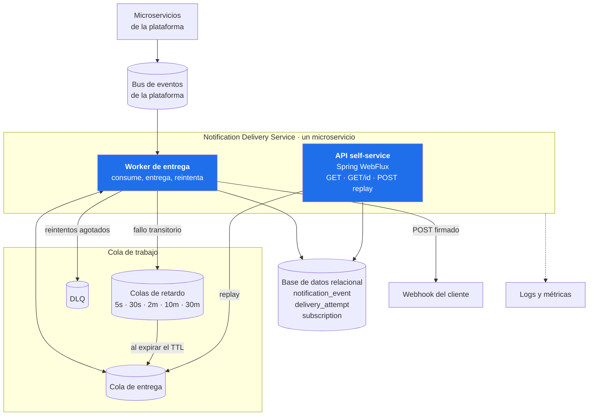
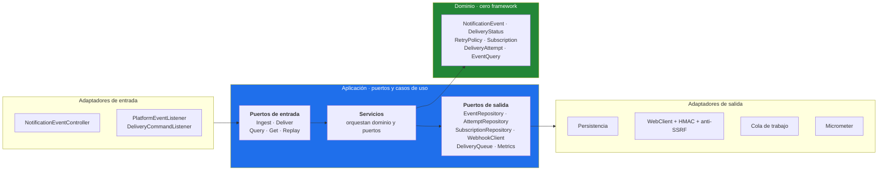
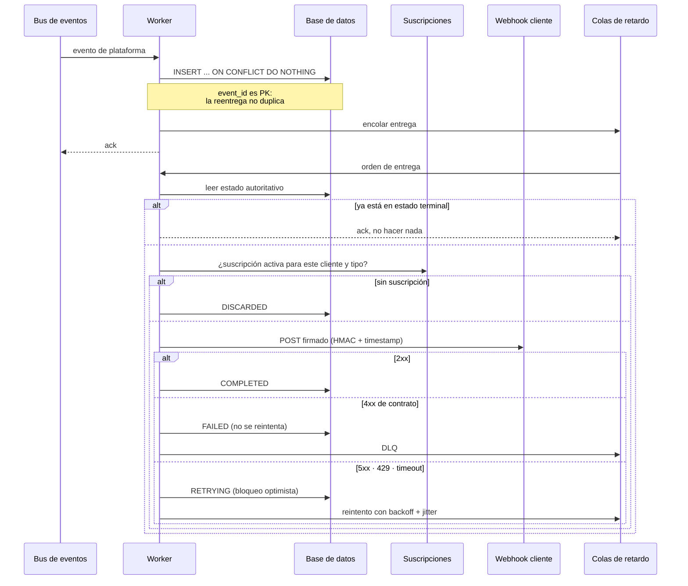
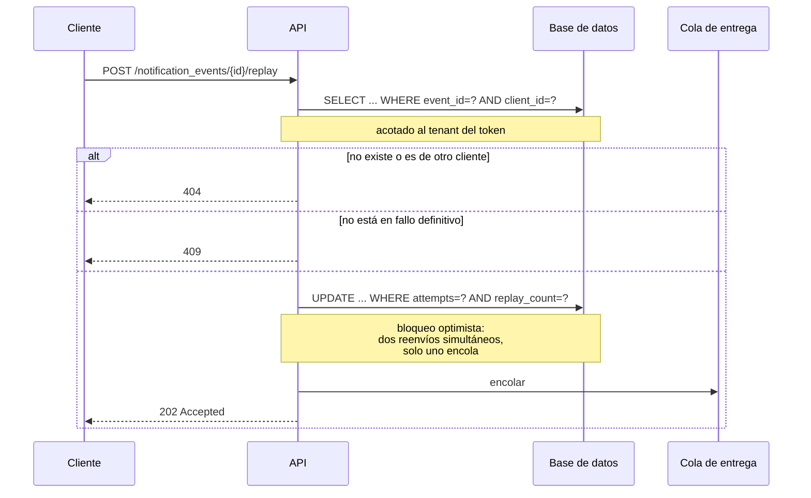
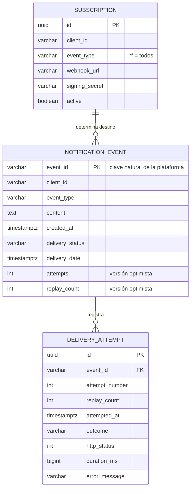
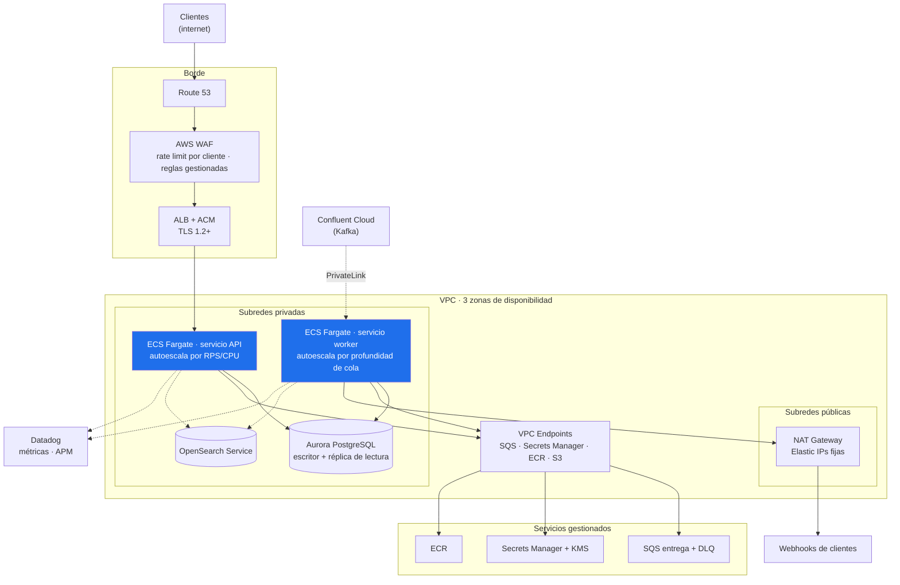

# Task 1 — Diseño del sistema

Entrega de notificaciones de eventos por webhook, más una API self-service para que
el cliente consulte y reenvíe sus notificaciones.

> **Cómo leer este documento.** El enunciado pide diseñar la solución garantizando
> escalabilidad y resiliencia; no fija nube, broker ni base de datos. Por eso el diseño
> está expresado en dos niveles separados a propósito:
>
> - **Secciones 1 a 8 — el diseño.** Estructura, garantías, máquina de estados y
>   propiedades que se le exigen a la infraestructura. Es independiente de productos y
>   es donde vive la respuesta a escalabilidad y resiliencia.
> - **Sección 9 — una materialización.** Un despliegue concreto en AWS, con los supuestos
>   que lo sustentan declarados y su origen citado.
>
> La sección 8 es la bisagra: dice qué necesita el diseño de su sustrato y cómo se cumple
> con distintas tecnologías. Si el broker o la nube resultan ser otros, cambia esa tabla
> y algún adaptador; no cambia el diseño.

---

## 1. El problema, en una frase

Cada evento que genera la plataforma (un pago recibido, un saldo actualizado) debe
llegar al webhook del cliente **al que ese evento pertenece**, sin perderse cuando el
destino falla, y dejando rastro suficiente para responder una queja con datos.

Son dos capacidades sobre un mismo modelo:

1. **Entrega**: consumir, confirmar suscripción, entregar, reintentar, registrar.
2. **Self-service**: consultar, ver detalle, reenviar.

---

## 2. Contexto (C4 nivel 1)

**Frontera deliberada:** este servicio no sabe qué significa un `credit_transfer` ni
valida reglas de negocio del evento. Su responsabilidad empieza cuando el evento ya
ocurrió y termina cuando la entrega quedó cerrada y registrada.

---

## 3. Contenedores (C4 nivel 2)

### Un microservicio, dos roles de ejecución

**La API y el worker son el mismo artefacto desplegado dos veces**: mismo contenedor,
distintos adaptadores activos. Conviene separar dos preguntas que suelen mezclarse.

**¿Despliegues separados? Sí.** Sus perfiles de carga no tienen nada que ver: la API
responde a personas y paneles (tráfico diurno, ráfagas pequeñas), mientras que el
worker sigue el ritmo de la plataforma y puede tener que drenar millones de eventos a
las 3 de la mañana. Escalarlos juntos significa pagar worker de más o quedarse corto de
API. Y si la API se satura, el cliente no puede consultar; si se satura el worker, **las
notificaciones no se entregan**. Son fallos de gravedad distinta y merecen aislamiento.
Además el worker no necesita exponerse a internet en absoluto.

**¿Microservicios separados? No.** Ambos operan sobre las mismas tablas y comparten la
misma máquina de estados. Dos servicios contra una misma base de datos es un monolito
distribuido: paga el costo de la red sin obtener el aislamiento. Y el límite de un
microservicio se traza por capacidad de negocio, no por capa técnica — "API" y "worker"
son capas. El *bounded context* aquí es uno: la entrega de notificaciones.

*Cuándo cambiaría:* si la entrega llegara a tener otro equipo dueño y otro SLA. Pero
entonces el corte correcto no sería API contra worker, sino que el servicio de entrega
fuera dueño de los datos y la API self-service pasara a ser un modelo de lectura
(CQRS), con el reenvío convertido en un comando publicado. Es una decisión que se toma
cuando duele, no antes.

---

## 4. Componentes: arquitectura hexagonal (C4 nivel 3)

Las dependencias apuntan **siempre hacia adentro**. `domain` y `application` no
importan una sola clase de Spring; el cableado vive completo en
`infrastructure/config/AppConfig`. Consecuencia práctica y verificable: las 141
pruebas del dominio y los casos de uso corren sin levantar contexto de Spring, sin
base de datos y sin broker, en menos de dos segundos.

### Regla que sostiene el aislamiento entre clientes

`EventQuery` **exige** `clientId` en su constructor. No es validación defensiva: es
que no existe forma de construir una consulta sin acotar por tenant. El `clientId`
sale siempre del token, nunca de la ruta ni del query string. La falla de
autorización a nivel de objeto (OWASP A01) no se previene con un `if`, se previene
haciendo que el caso inseguro no se pueda expresar.

---

## 5. Flujo de entrega con reintentos

### Las cuatro decisiones que importan aquí

**1. El mensaje lleva solo el identificador; el estado vive en la base.**
Un mensaje puede pasar 30 minutos esperando en una cola de retardo. Si llevara el
estado dentro, al procesarlo podría revertir algo más nuevo. Al releer, eso es
imposible.

**2. Reintentar lo que puede mejorar y solo eso.**
5xx, 408, 429, timeouts y errores de conexión se reintentan. Un 400 o un 404 no: el
payload o la ruta están mal y quien insiste solo gasta capacidad y ensucia las
métricas del destino. Las redirecciones tampoco se siguen — un 302 podría reapuntar
la petición a la red interna y evadir la validación anti-SSRF.

**3. El retardo lo hace el broker, no el proceso.**
Un `delayElement` en memoria se pierde con el reinicio o el reescalado. En la cola
sobrevive al despliegue. En RabbitMQ son colas sin consumidor con TTL por mensaje y
dead-letter de vuelta a la cola de entrega; en AWS es `DelaySeconds` de SQS.

**4. Una cola por escalón de backoff, no una con TTL variable.**
RabbitMQ solo expira mensajes desde la cabeza de la cola: con TTLs mezclados, un
mensaje de 30 minutos al frente bloquea a los de 5 segundos que vienen detrás. El
jitter se aplica como TTL por mensaje dentro de su escalón, así que el bloqueo de
cabeza queda acotado a esa ventana en vez de al rango completo.

### Por qué hay jitter

Si el webhook de un cliente se cae un minuto, **todas** sus notificaciones fallan a la
vez. Sin jitter, reintentarían todas en el mismo instante, tumbándolo de nuevo justo
cuando se estaba recuperando. El jitter del 20% las dispersa.

La invariante que lo hace seguro: cada escalón es más del doble que el anterior, así
que una espera con jitter nunca alcanza el escalón siguiente y el adaptador puede
deducir la cola destino a partir del valor ya jitterado.

---

## 6. Flujo de reenvío manual

**Responde 202 y no 200.** El reenvío queda encolado, no entregado. Si la API
entregara en línea, la petición del cliente quedaría atada al tiempo de respuesta de
su propio webhook y perdería toda la resiliencia del flujo normal: reintentos, DLQ,
bitácora.

**Solo se reenvía lo que está en `failed`.** Reenviar algo entregado duplicaría la
notificación; reenviar algo en curso competiría con el reintento ya programado.

---

## 7. Modelo de datos

- **`event_id` como clave primaria** hace la ingesta idempotente sin lógica extra: un
  `ON CONFLICT DO NOTHING` resuelve la reentrega del broker.
- **`delivery_attempt` es append-only.** Nunca se actualiza ni se borra. Es lo que
  permite responder "mi webhook nunca recibió X" con datos y no con suposiciones.
- **Índices `(client_id, created_at DESC)` y `(client_id, delivery_status, created_at DESC)`**
  con `client_id` primero, porque toda consulta está acotada al tenant.
- **El par `(attempts, replay_count)` es la versión optimista.** Si dos consumidores
  procesan el mismo evento a la vez — normal cuando el broker reentrega — solo uno
  escribe; el otro descubre que su versión quedó obsoleta en vez de sobrescribir.

### Supuesto documentado

El archivo `notification_events.json` no trae fecha de creación, solo `delivery_date`.
Como la API debe filtrar por *event creation date*, se modela `created_at` como el
instante en que la plataforma generó el evento y se siembra 2 segundos antes de la
entrega — el orden de magnitud real entre generación y entrega en un flujo asíncrono
sano.

---

## 8. Qué le exige este diseño a la infraestructura

Antes de elegir productos conviene fijar **qué propiedades** hacen falta. Esta es la
lista completa; cualquier sustrato que las cumpla sirve.

| # | Propiedad exigida | Por qué el diseño la necesita |
|---|---|---|
| 1 | **Entrega al menos una vez, con confirmación explícita tras procesar** | Si el proceso muere a mitad de una entrega, el mensaje debe reentregarse. Confirmar al recibir perdería notificaciones |
| 2 | **Reintento con retardo programado fuera del proceso** | Un `sleep` o un `delayElement` en memoria se pierde con el reinicio o el reescalado |
| 3 | **Destino terminal inspeccionable para lo no entregable (DLQ)** | Un mensaje envenenado reencolado es un bucle infinito que consume toda la capacidad |
| 4 | **Consumidores en competencia, sin orden garantizado** | Es lo que impide que el webhook lento de un cliente bloquee a los demás |
| 5 | **Durabilidad de los mensajes ante reinicio del broker** | Un evento de pago no puede vivir solo en memoria |
| 6 | **Almacén transaccional con escritura condicional** | La máquina de estados usa bloqueo optimista sobre `(attempts, replay_count)` |
| 7 | **Unicidad por clave natural** | `event_id` como clave primaria es lo que hace idempotente la ingesta |

### Una no-exigencia deliberada: orden global

El diseño **no pide** orden en la entrega, y eso es una decisión, no un descuido.
Exigirlo obligaría a serializar por partición o por cola, y entonces un solo cliente
con el webhook caído bloquearía a todos los que compartan esa partición. La ausencia
de orden es justamente lo que permite el aislamiento entre clientes.

El orden que sí importa —los intentos de una misma notificación— está garantizado por
otra vía: solo hay un mensaje en vuelo por evento a la vez, y el bloqueo optimista
rechaza cualquier escritura basada en una versión obsoleta.

### Cómo se cumplen con distintas tecnologías

| Propiedad | RabbitMQ | SQS | Kafka | Amazon MQ |
|---|---|---|---|---|
| 1 · At-least-once con ack | `consumeManualAck` | Visibility timeout | Commit de offset | Igual que RabbitMQ |
| 2 · Retardo | Cola por escalón con TTL + DLX | `DelaySeconds` nativo | **No lo tiene**: topic por escalón y código propio | Igual que RabbitMQ |
| 3 · DLQ | DLX + cola muerta | Redrive policy | Topic muerto manual | Igual que RabbitMQ |
| 4 · Sin orden, en competencia | Sí | Sí (cola estándar) | **No**: orden por partición → bloqueo de cabeza | Sí |
| 5 · Durabilidad | Mensajes persistentes | Nativa | Nativa | Nativa |

**La conclusión sale de la tabla, no de una preferencia.** Kafka falla en las
propiedades 2 y 4, que son exactamente las que sostienen los reintentos y el
aislamiento entre clientes. Es un excelente bus de eventos de negocio y una mala cola
de trabajo. Por eso, si el bus de la plataforma es Kafka, lo correcto es **consumir de
él y traspasar a una cola de trabajo** para la entrega — no forzar a Kafka a hacer de
las dos cosas.

Ese razonamiento vale igual si el bus resulta ser RabbitMQ, Pub/Sub o SNS: cambia qué
adaptador de entrada se escribe, no la estructura.

### Qué ya está implementado y qué no

| Propiedad | En este repo |
|---|---|
| 1, 2, 3, 4, 5 | Implementadas sobre RabbitMQ, verificadas en ejecución |
| 6, 7 | Implementadas sobre PostgreSQL, verificadas en ejecución |

La sección siguiente traduce todo esto a una nube concreta.

---

## 9. Una materialización: despliegue en AWS

> **Supuestos de esta sección, y su origen.** Que la infraestructura es AWS y que la
> plataforma publica en Confluent Cloud proviene de descripciones de vacantes y perfiles
> públicos de la compañía, más las IPs de egreso que la propia documentación de Cobre
> pide poner en lista blanca (`50.17.12.196`, `54.173.144.191`, ambas en rangos EC2 de
> `us-east-1`). Es una señal fuerte, no documentación oficial de arquitectura.
>
> **Nada de las secciones 1 a 8 depende de que esto sea cierto.** Lo que sigue es una
> instanciación defendible, no el diseño.

### Traducción de la implementación local a AWS

| Local (este repo) | AWS | Qué cambia en el código |
|---|---|---|
| RabbitMQ (entrada) | Confluent Cloud / Kafka | Un adaptador de entrada nuevo |
| RabbitMQ (entrega y retardo) | SQS + `DelaySeconds` + redrive | Un adaptador de salida nuevo |
| PostgreSQL en Docker | Aurora PostgreSQL | Nada: sigue siendo R2DBC |
| Filebeat + Elasticsearch | FireLens → OpenSearch Service | Nada: la app escribe ECS a stdout |
| Prometheus | Datadog Agent (OpenMetrics) | Nada: el `MetricsPort` no cambia |
| Secreto HS256 en properties | Secrets Manager + JWKS del IdP | Solo configuración |

**El dominio, los casos de uso y sus pruebas no aparecen en esa columna.** Ese es el
retorno concreto de la arquitectura hexagonal, y es verificable: basta ver qué
paquetes importan `org.springframework` o `com.rabbitmq`.

### Por qué Kafka a la entrada pero SQS a la entrega

Kafka es el bus correcto para el evento de negocio: es donde la plataforma ya publica
y da orden por partición y reprocesamiento histórico.

Pero para la **entrega** sería una mala elección, por una razón concreta: en Kafka el
paralelismo está topado por el número de particiones y el orden se respeta dentro de
cada una, así que **un webhook lento bloquea a todos los clientes que compartan su
partición**. Es exactamente el problema que este servicio no puede tener. SQS no
promete orden, y esa "carencia" es justo lo que permite que un cliente caído no afecte
a los demás. Además trae de fábrica lo que en Kafka hay que construir: retardo por
mensaje, DLQ y reintentos.

### Por qué ECS Fargate

Con PCI DSS v4.0.1 encima, no administrar nodos no es comodidad sino **superficie de
cumplimiento**: menos que parchear, menos que auditar, menos que documentar. Un solo
microservicio no justifica operar una plataforma Kubernetes propia.

*El criterio que revertiría esta decisión:* si Cobre ya opera EKS con su malla de
servicios, políticas y pipelines auditados, desplegar aquí sobre EKS es correcto —
reusar una plataforma existente casi siempre gana sobre introducir una segunda. Y
KEDA escala por profundidad de cola mejor que el autoescalado de ECS.

### Egreso por NAT con IPs fijas

Los webhooks salen por NAT Gateway con Elastic IPs estáticas. No es un detalle de red:
los clientes empresariales — bancos, PSPs — necesitan **poner en lista blanca las IPs
de origen de Cobre** en sus firewalls. Sin IPs estables, cada reescalado rompería
integraciones.

---

## 10. Escalabilidad

Los mecanismos son independientes del producto; la última columna es solo cómo se
instrumentan en la materialización de la sección 9.

| Dimensión | Mecanismo | Señal de autoescalado | En AWS |
|---|---|---|---|
| API self-service | Réplicas sin estado tras un balanceador | RPS por réplica / CPU | ECS Fargate + ALB |
| Worker de entrega | Consumidores en competencia sobre la cola | Profundidad de la cola | `ApproximateNumberOfMessagesVisible` |
| Lecturas de la API | Réplica de lectura, separada del camino de escritura | Latencia de consulta | Aurora read replica |
| Escrituras | Nodo escritor; particionar por `client_id` si llega el caso | — | Aurora writer |
| Ingesta desde el bus | Consumidores hasta el paralelismo que permita el bus | Retraso del consumidor | Lag del consumer group |

**El cuello de botella real no es nuestro: es el webhook del cliente.** Por eso la
métrica que gobierna el autoescalado del worker es la profundidad de cola y no la CPU
— la CPU se queda plana mientras el servicio espera respuestas de red, y un
autoescalado por CPU no reaccionaría nunca.

**Vecino ruidoso.** Hoy todos los clientes comparten la cola de entrega. Un cliente con
un pico de millones de eventos retrasa al resto. La evolución natural es una cola
dedicada para los clientes de alto volumen; el `client_id` ya viaja en el mensaje
precisamente para poder enrutar sin cambiar el productor.

---

## 11. Resiliencia

| Riesgo | Mitigación | Dónde está |
|---|---|---|
| Perder un evento | Confirmación manual tras procesar + confirmaciones del broker al publicar | `AbstractAmqpListener`, `RabbitDeliveryQueueAdapter` |
| Duplicar la notificación | `event_id` como PK + guarda de estado terminal | `IngestNotificationEventService`, `DeliverNotificationEventService` |
| Doble escritura concurrente | Bloqueo optimista `(attempts, replay_count)` | `NotificationEventRepositoryPort.update` |
| Webhook caído | Backoff exponencial con jitter, 5 intentos | `RetryPolicy` |
| Fallo definitivo | Estado `failed` + DLQ + endpoint de reenvío | `DeliveryQueuePort.sendToDeadLetter` |
| Mensaje envenenado | Rechazo sin reencolar → DLQ | `AbstractAmqpListener` |
| Destino que no responde | Timeouts de conexión y respuesta | `WebhookProperties` |
| Broker no disponible al arrancar | Falla rápido en el arranque | `RabbitTopologyInitializer` |

### Garantía real, dicha con precisión

El sistema es **at-least-once**, no exactly-once. Si el webhook responde 200 pero la
red corta la respuesta antes de que la recibamos, se registrará el intento como fallo
y se reintentará: el cliente verá la notificación dos veces.

Por eso el `event_id` viaja en el payload — **para que el receptor pueda deduplicar
con su propia escritura idempotente**. Prometer exactly-once de extremo a extremo
sería falso, y es mejor documentar la garantía real que dejar que el cliente la
descubra en producción.

---

## 12. Limitaciones conocidas

Cosas que faltan, dichas antes de que las pregunte el panel:

1. **Sin circuit breaker por cliente.** Si el webhook de un cliente lleva horas caído,
   cada evento suyo sigue gastando 5 intentos y capacidad del worker. Un breaker
   (Resilience4j) por destino cortaría en seco y reabriría con sondeos.
2. **Rate limit por instancia.** El contador vive en memoria; con tres réplicas el
   límite efectivo es el triple. Contiene el abuso accidental, no el deliberado. En
   AWS esto se resuelve en WAF, que además protege antes de que el tráfico llegue al
   servicio.
3. **Sin pruebas de integración con infraestructura real.** El gate de cobertura
   excluye los adaptadores de persistencia. Testcontainers los traería de vuelta.
4. **Secretos de firma en texto plano en la base.** Deben vivir cifrados con KMS o en
   Secrets Manager.
5. **La DLQ no tiene proceso automático.** Hoy se inspecciona a mano; falta una alarma
   por profundidad y un flujo de reproceso masivo.
6. **HS256 con secreto compartido.** Adecuado para la prueba; en producción, validación
   por JWKS contra el IdP de Cobre, que rota claves sin redesplegar.

---

## 13. Camino a producción

1. **CI**: `./gradlew build` en cada PR — pruebas más gate de cobertura del 90%.
2. **CD**: imagen a ECR, despliegue azul/verde en ECS con `readinessProbe` sobre
   `/actuator/health/readiness`.
3. **Migraciones**: Flyway corre al arrancar; para cero downtime, cambios de esquema
   compatibles hacia atrás en dos despliegues (expandir, migrar, contraer).
4. **Apagado ordenado**: dejar de tomar mensajes, terminar los que están en vuelo,
   cerrar. Sin esto, cada despliegue genera reentregas evitables.
5. **Alarmas**: tasa de `failed` sobre el total, profundidad de la DLQ, latencia p99 de
   los webhooks, lag del grupo de consumo de Kafka.
